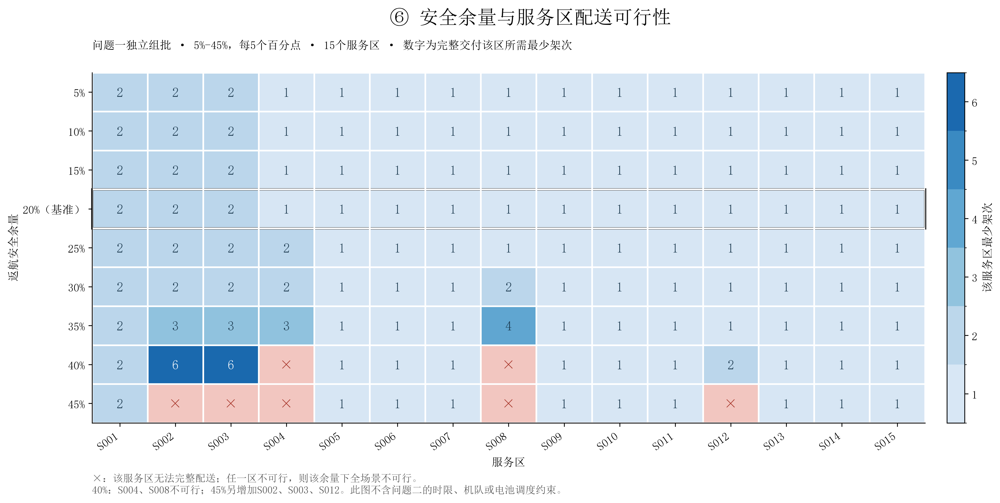

# 山区洪涝灾害下无人机运输与通信协同优化

问题一、问题二的建模代码、计算结果及可视化归档。问题三尚未实现。最新问题二推荐结果为21架次、63.845040 kWh、6361.702秒完成，80箱全部按期、31个硬截止均满足；模型、3:1.5:1:0.5主权重与冻结归一化尺度保持不变。本次提交同步已有计算结果，不重新运行优化。

## 内容

- [建模工程与运行说明](建模/README.md)：Python入口、配置、依赖与接口。
- [问题一模型](建模/docs/问题一模型说明.md)：单点往返安全载荷与精确组批。
- [问题二模型](建模/docs/问题二模型说明.md)：多点运输、逐箱交付与机队/电池联合调度。
- [问题二加权目标](建模/docs/问题二加权目标说明.md)：固定归一化、显式偏好与情景对照。
- [最新改进结果与差距分析](建模/outputs/q2_improved/优化结果与差距分析.md)：紧凑候选池与联合重排后的数值结果。
- [WGS84基础几何数据](建模/outputs/common_geometry/README.md)：节点坐标、距离矩阵、240条航段及720条机型飞行时间。
- [公式来源与假设审计](建模/docs/公式来源与假设审计.md)：区分原题、文献依据、推导和简化假设。
- [文献公式核查](建模/references/可用公式与适用性.md)：保留研究笔记；下载的文献全文、网页存档和页面截图未包含在本代码仓库。

## 已计算结果

| 内容 | 报告 | Excel或图表 |
|---|---|---|
| 问题一基准与原敏感性 | [结果分析](建模/outputs/q1/问题一结果分析.md) | [Excel](建模/outputs/q1/问题一结果.xlsx) |
| 问题一5%—45%安全余量 | [结果分析](建模/outputs/q1_sensitivity_05_45/问题一结果分析.md) | [Excel](建模/outputs/q1_sensitivity_05_45/问题一结果.xlsx) |
| 问题二词典序历史实验 | [结果分析](建模/outputs/q2/问题二结果分析.md) | [Excel](建模/outputs/q2/问题二结果.xlsx) |
| 问题二加权基线 | [权衡分析](建模/outputs/q2_weighted/四指标加权权衡分析.md) | [Excel](建模/outputs/q2_weighted/问题二结果.xlsx) |
| 问题二最新改进（仅数值） | [结果与原因](建模/outputs/q2_improved/优化结果与差距分析.md) | [完整JSON与CSV](建模/outputs/q2_improved/tables) |
| 问题一主体图组 | [图组目录](建模/outputs/q1_core_figures) | [绘图代码](建模/scripts) |
| ①②⑤⑥扩展图表 | [图表说明](建模/outputs/visualizations/图表说明.md) | [PNG与PDF](建模/outputs/visualizations/figures) |

每个结果目录保留明细及核验记录。问题一基准为18架次、59.132260326 kWh。题二版本明确区分：`q2`中的词典序及时性方案为31架次、85.864101 kWh；`q2_weighted`加权基线为24架次、70.781829 kWh；`q2_improved`最新推荐为21架次、63.845040 kWh。后者全部货箱按期，A/B/C架次为8/7/6，最低返航SOC为20.0917%。旧图与旧实验各自对应所在目录的方案，不代表最新21架次结果。

问题一5%—45%敏感性每5个百分点一档。40%和45%均无完整可行方案；不可行场景不以部分交付总量替代完整方案。



## 本地复现

Python 3.12及以上；建议创建独立虚拟环境。原始题目附件、提交模板、论文工程、中文字体和本机运行时未随代码上传。先按下列相对位置准备自己持有的原始附件与字体：

```text
仓库根目录/
├─ 建模/                         # 本仓库已提供
├─ 数据/                         # 原始数据目录，保留题目附件层级与文件名
├─ 结果提交模板.xlsx
└─ 写作/fonts/SimSun.ttf          # 配置指定的中文字体，可改为本地已有的中文字体
```

具体输入文件与原运行哈希可在`建模/outputs/*/logs/run_manifest.json`中核对。历史日志包含原机器路径，仅用于溯源；它们不是可移植运行配置。图表入口当前要求来源数据与保存结果哈希匹配；迁移后需将结果元数据中的原机器文件路径映射到本地相同原文件，不能更改或跳过哈希核验。

```bash
cd 建模
python -m venv .venv
# 激活虚拟环境后：
python -m pip install -r requirements-q2.txt
python run_q1.py --config configs/q1.toml --skip-excel
python run_q1.py --config configs/q1_sensitivity_05_45.toml --skip-excel
python run_q2.py --config configs/q2.toml --skip-excel
python scripts/plot_extended.py
```

题二加权搜索和数值改进入口：

```bash
# 先完成run_q2.py，生成本地cache/q2/candidates.json和正式历史结果。
python run_q2_weighted.py --config configs/q2_weighted.toml
python scripts/improve_q2_pool.py
python run_q2_improve.py --seconds 150
python scripts/export_q2_improvement.py
```

后三条只输出数值、JSON/CSV和文字分析，不生成新图。最后一条仅核验与重导出保存方案。仓库没有包含候选缓存；已有快照中的`reference_path`、输入哈希表和来源文件路径保留原机器绝对位置。**当前入口尚未自动完成跨机器路径映射**：直接使用仓库历史快照前，须在加载层将这些路径映射到本机同一文件并保留内容哈希核验；不得仅照搬旧绝对路径。也可先在本机从原始附件运行问题二以产生本地元数据，再继续加权和改进实验。仅阅读已保存数值不需要上述准备。

`requirements*.txt`记录原计算环境的固定依赖版本。Excel导出脚本依赖Codex配套的`@oai/artifact-tool`和Node.js；普通Python环境可用`--skip-excel`生成计算明细，直接查看仓库中已导出的Excel。问题二默认求解预算及数值口径见配置与工程说明；限时搜索不保证原问题全局最优，现有历史方案可独立核验。

原始附件缺失时不能从零重算，但仍可直接阅读本仓库的CSV、JSON、Excel、PNG及PDF。研究笔记里指向未上传原文或历史本机文件的链接需要相应原资料；结果报告内的图表链接已改为仓库相对路径。

## 计算口径与可追溯性

能耗为题给等效航程与文献依据下势能附加项的简化模型，未做实际飞行标定。硬时限、SOC与资源检查通过只能证明当前模型下的数值可行性。

`UPLOAD_MANIFEST.json`记录上传快照的源文件和仓库文件SHA-256。结果数值文件保持原始字节；Markdown仅将本项目内绝对文件/图表链接转换为相对链接。运行环境、可再生成缓存、Excel锁文件及试运行目录不纳入提交。
