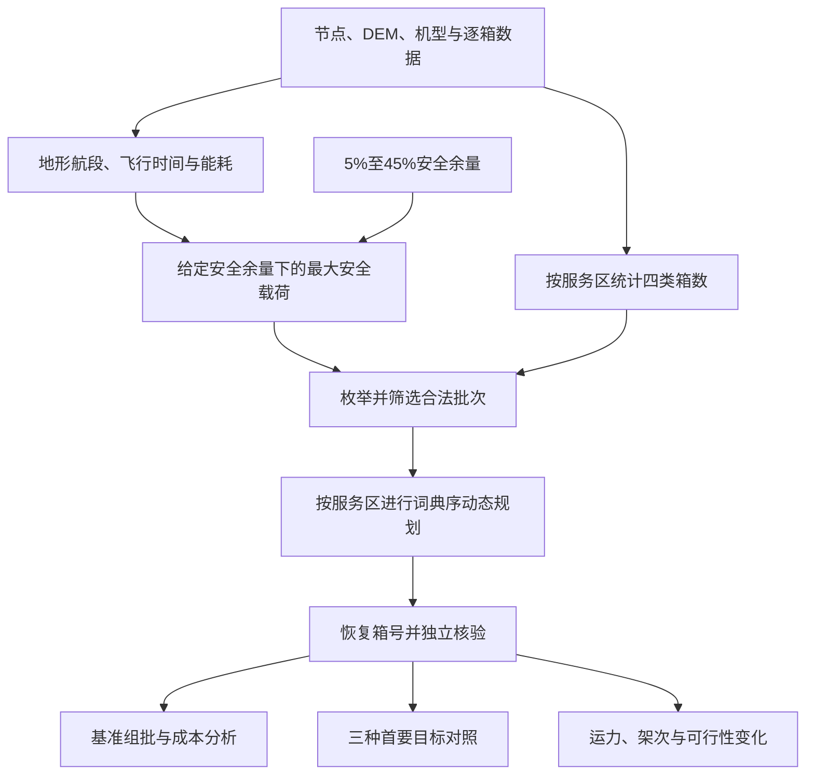

# 问题一写作构思：地形与返航能量约束下的货箱精确组批

本文件是写作提纲与论证安排，不是论文定稿。依据已核验的模型、六种目标顺序补充结果及5%—45%敏感性结果整理；不重新求解，不改变物理口径。参考PDF只用于组织和版式，不作为本题规则或能耗公式来源。

## 一、参考稿中值得借鉴的组织方式

已查看《写作格式参考.pdf》的目录、假设与符号页，以及完整问题一部分。以下“PDF页”按文件从1起计，“印刷页”是页面底部编号。

| 参考位置 | 实际组织方式 | 在本题中的使用方法 |
|---|---|---|
| PDF第3、9页，印刷第2、8页 | 问题分析、模型假设、符号说明先于建模求解 | 公共坐标、基本假设和统一符号先说明；第一问只补充自身边界 |
| PDF第13页，印刷第12页，5.3节、图5.3 | 问题一先展示求解流程，再用一段文字概括 | 以“地形航段→安全载荷→合法批次→精确优化→结果与敏感性”开篇 |
| PDF第14—23页，印刷第13—22页 | 三级标题分解任务，穿插公式、图表和解释 | 每小节回答一个明确问题；公式后解释变量、单位与假设，图后给定量结论 |
| PDF第24—25页，印刷第23—24页，5.3.5节 | 以“问题一总结”收束 | 用三条结论逐项回答原题，不再重复算法步骤 |

版面上可借鉴单栏、分级标题、居中公式及右侧编号、居中图题和正文交叉引用。参考稿的表题存在放在表下的例子，本项目建议仍按现有模板统一采用表题在上、图题在下，不逐项复制。数值表采用三线表，符号表必须有单位。

不照搬参考稿的M-K检验、Pearson分析或回归模型；它们不解决本题的离散组批问题。参考稿也不代表赛事官方排版规定，字体、页边距、编号继续由当前LaTeX模板统一控制。

当前 `写作/sections/problem1.tex` 仍包含混凝土配比、碳排放、NSGA-II等示例；`sections/assumptions.tex` 也仍是示例。正式落笔时应替换这些内容，不能只在其后追加无人机模型。本次不修改这些文件。章节编号由LaTeX自动生成，不硬写参考稿的“5.3”。

## 二、中心论点与章节骨架

建议章名：**问题一：地形与返航能量约束下的单点货箱组批优化**。

本章要完成的论证是：先把地形和机型参数转为单次运输的可行域，再在不可拆货箱上求精确组批，最后用目标对照和安全余量分析解释方案选择的代价。

| 拟定小节 | 必须回答的问题 | 主要证据与图表 |
|---|---|---|
| 1. 地形航段与最大安全载荷 | 一种机型到一个服务区，最多能安全带多重？ | 航段模型、能耗推导、安全载荷定义；45组载荷结果的摘要表 |
| 2. 不可拆货箱的组批优化模型 | 如何保证每箱一次，同时满足三类运输约束？ | 四维组成、候选可行域、精确覆盖、词典序目标 |
| 3. 精确求解与最优性核验 | 为什么求得的是本模型下的最优解？ | 动态规划、状态规模、等价性说明、18架次下界、MILP复核 |
| 4. 基准组批方案及服务区差异 | 80箱究竟怎样分配，成本主要体现在哪里？ | 图①②③及主方案汇总指标 |
| 5. 三项目标的优先关系与权衡 | 分别优先架次、能耗、时间，会付出什么代价？ | 图④及三种首要目标对照表 |
| 6. 返航安全余量敏感性 | 运力如何下降，何时增批，哪些服务区不可配送？ | 图⑤⑥⑦及不可行证据 |
| 7. 问题一小结 | 对原题三项要求各给出什么答案？ | 组批结果、偏好解释、安全余量影响各一段 |

篇幅初步建议8—10页，随全文页数和图中文字可读性调整；这是编辑安排，不是赛事要求。建模与算法约3页，基准结果与权衡约2—3页，敏感性约2—3页。无需为凑页数增加通用算法介绍。

建议流程图内容如下，可在正式写作时转为TikZ矢量图：

流程图中的余量分析代表各档重新计算可行域并优化，不是对基准指标简单乘系数；此次写作直接使用已经保存的九档计算结果。

## 三、各小节的落笔内容

### 1. 地形航段与最大安全载荷

先用一段话限定：每架次仅采用O01→Si→O01，去程携带整批货物，返程空载；本问不限制实体机库存、共享电池、通信及绝对交付时刻。因此“18架次”不是18架无人机，“累计作业时间”也不是并行完工时间。

坐标转换宜放在公共预处理或附录，本节保留真正影响运输可行性的公式。以 `0` 表示O01，令相交DEM像元集合为 \(\mathcal C_{ij}\)，节点作业海拔为 \(z_i^{op}\)：

\[
H_{ij}=\max_{(r,c)\in\mathcal C_{ij}}z_{rc}+50,\qquad
h^+_{ij}=H_{ij}-z_i^{op},\qquad h^-_{ij}=H_{ij}-z_j^{op}.
\]

说明相交集合包含边界和角点接触像元；节点作业海拔使用节点表，服务区加30m，不能用DEM值强行替换。去返程巡航高度相同，起点作业高度不同，爬升须分别计算。

\[
t_{gij}=\frac{h^+_{ij}}{v_g^\uparrow}+\frac{d_{ij}}{v_g^c}+\frac{h^-_{ij}}{v_g^\downarrow},\qquad
L_g(q)=L_g^0-(L_g^0-L_g^F)(q/Q_g)^{3/2}.
\]

能耗式须与来源说明紧邻，不能把说明藏到结尾：

\[
E_{gij}(q)=\underbrace{E_g^{use}\frac{d_{ij}}{L_g(q)}}_{\text{水平飞行项}}
+\underbrace{\frac{(m_g^0+q)g_0h^+_{ij}}{3.6\times10^6\eta_g}}_{\text{爬升附加项}}.
\]

建议文字：参考Zhang等附录A式(A1)的电池能量/航程折算关系，并将题给等效航程解释为相同载荷下消耗全部可用电量的水平航程，得到第一项。参考其附录C式(C1)中的爬升机械功率分量 \(Mg v_a\sin\theta\)，积分得到 \(Mgh\)，再按题给机载效率折算，得到第二项。该式是结合题给参数建立的简化模型，未完成真实飞行能耗标定。

正文至少注明：\(m_g^0\)已含电池；距离用m、能量用kWh；\(g_0=9.80665\,\mathrm{m/s^2}\)；下降计时间但不另加附加能耗，不代表真实下降功率为零；无给定参数的运输悬停耗能不另设。20%安全余量只在整架次预算中扣除一次。

继而定义：

\[
E^{RT}_{ig}(q)=E_{g0i}(q)+E_{gi0}(0),\qquad
q^{safe}_{ig}(\rho)=\max\{q\in[0,Q_g]:E^{RT}_{ig}(q)\le(1-\rho)E_g^{use}\}.
\]

说明能耗随载荷不减，先检查空载、满载，再以 \(10^{-6}\) kg精度二分；空载不满足预算时标记不可达。安全载荷是连续质量上限，尚未包含货箱体积和不可拆性。

载荷摘要可写：20%余量下，A型各区均为25kg；B型为28.801360—30kg，仅S008受能量限制；C型为58.904166—80kg，S002、S003、S004、S008、S012受能量限制。45行完整结果放附表。

### 2. 不可拆货箱的组批优化模型

先解释压缩理由：同服务区、同类别货箱质量与体积相同，且本问无逐箱时限，故以四类箱数向量 \(\boldsymbol k\) 表示批次不会丢失优化信息。若以全局类别符号 \(m_c,v_c\) 表示属性，应以输入核验为前提；推广到同类不同区属性有差别时需改为 \(m_{ic},v_{ic}\)。

定义批次质量 \(q(\boldsymbol k)=\sum_c m_ck_c\)、体积 \(v(\boldsymbol k)=\sum_c v_ck_c\)。候选集合 \(\mathcal B_i\) 仅含非空组成，且同时满足：

\[
q(\boldsymbol k)\le Q_g,\quad v(\boldsymbol k)\le V_g,\quad
E^{RT}_{ig}(q(\boldsymbol k))\le(1-\rho)E_g^{use}.
\]

令 \(x_{ig\boldsymbol k}\) 为使用该批次的次数，写出精确覆盖：

\[
\sum_{(g,\boldsymbol k)\in\mathcal B_i}k_cx_{ig\boldsymbol k}=n_{ic},\qquad
x_{ig\boldsymbol k}\in\mathbb Z_{\ge0}.
\]

“每箱一次”的解释不可省略：箱数覆盖约束保证各类数量完全匹配，回溯后从各类固定排序的箱号池中依次取箱，并以原始80个箱号独立检查不重不漏。不能只说质量总和相等就证明逐箱交付完整。

设 \(n_{\boldsymbol k}=\sum_ck_c\)，累计作业耗时为：

\[
T_{ig\boldsymbol k}=t_g^{prep}+n_{\boldsymbol k}t_g^{load}
+t_{g0i}+t_{gi0}+t_g^{handover}+n_{\boldsymbol k}t_g^{box}.
\]

最后写主目标 \(\operatorname{lexmin}(N,E,T)\)，其中三项均为选中批次相应指标之和。用自然语言解释先最少架次，再在最少架次解中最少能耗，最后最少累计作业时间。这个偏好反映减少往返组织次数的考虑，不是原题唯一规定，也不使用任意大权重替代优先级。

### 3. 精确求解与最优性核验

保留一个递推式和一段简洁伪代码即可：

\[
F_i(\boldsymbol s)=\min_{lex}\{F_i(\boldsymbol s-\boldsymbol k)
+(1,E^{RT}_{ig}(q(\boldsymbol k)),T_{ig\boldsymbol k}):
(g,\boldsymbol k)\in\mathcal B_i,\ \boldsymbol k\le\boldsymbol s\},
\qquad F_i(\boldsymbol0)=(0,0,0).
\]

伪代码的必要步骤：枚举组成→三约束筛选→按箱数状态递推→记录前驱→回溯机型和组成→还原箱号→独立核验。不可行状态无有效值，不将其赋成零成本。

论证按以下顺序展开：

1. **压缩等价。** 每个逐箱方案对应一个组成方案，组成方案也能还原为合法箱号分配，目标不变。
2. **递推完备。** 每个非空可行方案都能移除一个合法批次，余下状态更小，故递推遍历全部组批分解。
3. **分区可加。** 本问无跨区组批及共享资源约束，目标可加，各区逐级最优的和即为全局相同顺序的最优值。
4. **数值核验。** 全部状态仅644个，S001最多324个；六种目标排列分别对15个区做三阶段MILP复核，即90组、270阶段。与逐箱重算相结合，核对优化及可行性。

再给独立的架次数下界证据：仅考虑各区需求质量和体积，分别除以所有机型中的最大质量、体积容量并向上取整，取二者较大值；忽略能量和箱子不可拆性只会放松问题，因此是下界。15区合计下界为18，其中S001、S002、S003至少2次，其余至少1次。主方案18次达到下界。这只直接证明第一目标，能耗和时间的后续最优性由完整枚举与分层核验支撑。

“精确”限定于上述模型与既有数值精度：能耗按 \(10^{-12}\) kWh、时间按 \(10^{-6}\) s量化比较，物理能量容差为 \(10^{-9}\) kWh。详细误差界、程序测试及日志移至附录，不将求解器最优终止写成物理实测验证。

### 4. 基准组批方案及服务区差异

先交代主结果，再放图，最后解释约束与结构：

> 在20%返航安全余量下，80个货箱共758kg、2.011m³全部配送完成，主方案安排18架次，其中B型和C型各9架次，A型未被选用。总运输能耗为59.132260kWh，累计作业时间为9.104588h。逐箱复核未发现重复或遗漏，最低返航SOC为23.089248%，满足20%下限。

随后按图①→图②→图③解释：

- 图①回答每批装哪些完整箱子，不把横向箱格长度解释为质量；旁注才是实际质量与体积。
- 图②分别核对质量、体积、SOC，解释不能只检验总质量。SOC高于下限的3.089248个百分点是该方案的最小安全余量余裕，不等同于“最优临界余量”。
- 图③把各区累计作业时间分为准备、装载、飞行、基础交接、逐箱交接，能耗分为水平与爬升；讨论批次数和航段条件共同作用。具体“最高/最低”的服务区必须从绘图明细确认后再写，不凭路线远近推断。

至少分析两种有意义的局部现象：S001—S003的需求量下界如何导致至少2批；S008等能量限制区为何不能直接按额定载质量装载。机型选择表命名为“主方案机型选用统计”，A型未入选不意味着其在其他目标或约束下无用。

### 5. 三项目标的优先关系与权衡

主文使用下面三行，保证每个指标都作为第一目标出现：

| 目标顺序 | 架次 | 能耗/kWh | 累计作业/h | A/B/C架次 |
|---|---:|---:|---:|---|
| 架次→能耗→时间（主方案） | 18 | 59.132260 | 9.104588 | 0/9/9 |
| 能耗→架次→时间 | 19 | 59.034878 | 9.566802 | 0/11/8 |
| 时间→架次→能耗 | 18 | 59.132260 | 9.104588 | 0/9/9 |

配图④后，建议以这段为分析核心：

> 能耗优先方案相对主方案增加1架次，节能0.097383kWh，约为0.1647%，累计作业时间增加27.733min。就这两类可行解而言，较小的节能幅度伴随更多往返和作业耗时，因而选择架次优先具有明确的偏好依据。时间优先与架次优先取得相同汇总指标，表明本数据下这两项目标的最优取值相容；这不是普遍规律，也不能据此断言所有逐箱分配相同。

六种完整排列放附表；不要使用旧三行表替代时间优先，也不要称为完整Pareto前沿。选择主方案是解释决策偏好，不声称所有指标同时优于能耗优先方案。

### 6. 返航安全余量敏感性

以固定主目标顺序、只改变 \(\rho\) 为控制原则，取5%、10%、…、45%九档，每档重新计算安全载荷和最优组批。按“连续运力→离散批次→局部不可行”组织图⑤⑥⑦。

| 余量 | 完整配送可行性 | 架次 | 能耗/kWh | 累计作业/h | A/B/C架次 |
|---|---|---:|---:|---:|---|
| 5%、10%、15%、20% | 均可行 | 18 | 59.132260 | 9.104588 | 0/9/9 |
| 25% | 可行 | 19 | 61.074311 | 9.601711 | 0/10/9 |
| 30% | 可行 | 20 | 67.228732 | 10.162968 | 0/9/11 |
| 35% | 可行 | 25 | 75.608929 | 12.606724 | 0/15/10 |
| 40% | S004、S008不可行 | — | — | — | — |
| 45% | S002、S003、S004、S008、S012不可行 | — | — | — | — |

需要解释的机制：提高余量缩小电量预算，使连续安全载荷不增；当原批次不能满足预算时，重新组批或切换机型，表现为架次数的离散跃迁。5%—20%的已算档位虽然预算不同，但最优汇总指标相同；不能由此断言安全载荷完全不变。

40%和45%的不可行不是空载不可达的同义词。已有诊断表明某些需求箱即使单箱也无法由任何机型满足往返能量预算；因能耗随载荷不减，合批也无法挽救，故可证明完整配送不可行。例如40%时S004的饮用水箱无法配送。主文给一个例子，详细逐类诊断放附录。

总指标在不可行档位留空，不能把已送部分的架次当作完整方案总数。图⑦仍展示其他服务区的局部结果。可行域缩小时最少架次数不减，但本模型是词典序优化，不能要求第二、第三目标在所有情形下也单调。5个百分点采样只能定位变化区间，不能称40%为精确不可行阈值。

### 7. 问题一小结与后续衔接

小结按题意写三条：给出满足逐箱及运输约束的18架次方案；量化能耗优先的节能与时间代价，并说明采用的偏好；总结九档余量下的运力、组批变化与受影响服务区。

最后一两句衔接问题二：本问求解的是独立单点任务的组批与累计成本，未安排有限实体机和电池的时间占用。后续允许多点运输并加入资源、时限后，需要重新优化，不能直接沿用本问的最优性结论。

## 四、图表落位与正文/附录分工

图号①—⑦只是当前图册编号，正式论文使用自动编号。

| 现有图 | 建议落位 | 排版处理 |
|---|---|---|
| ① 各服务区货箱组批方案 | 基准结果主图 | 优先整页或足够高的通栏，确保18批、80个箱号能读；完整逐箱表放附录 |
| ② 批次装载与返航安全 | 基准可行性分析 | 有篇幅时紧随①；压缩版放附录，正文保留独立核验结论和最低SOC |
| ③ 各服务区组批统计 | 基准结果分析 | 当前横向四联图很宽，正式版重排为2×2或拆为上下两图，不硬缩到A4通栏 |
| ④ 目标优先级权衡 | 目标权衡节 | 保留三种首要目标；表承载精确值，图突出差异，避免重复逐项描述 |
| ⑤ 安全余量与最大安全载荷 | 敏感性第一段 | 三机型分面及额定载质量、20%线；保留服务区线型识别，必要时整页排布 |
| ⑥ 安全余量与组批结果 | 敏感性第二段 | 保留总体可行与不可行的断点；如需要压缩，可把四联图放附录、正文保留精简九档表 |
| ⑦ 安全余量与服务区可行性 | 敏感性第三段 | 正文保留，135格直接定位局部增批及不可配送区 |

地形剖面可在第一节放一幅小示意或移附录，二维/三维路线图主要作辅助。第一问只含单点往返，过多路线图不能代替组批结果。

正文优先使用矢量PDF，终稿缩放后复核字号。当前图文件位于 `../outputs/q1_core_figures/figures/`，重排时继续使用配套JSON/CSV，保留原版。每幅图采用“先引图→读数值→解释原因→指出适用边界”的段落顺序，避免只有“由图可知，模型有效”。

附录建议包括：45组安全载荷、18批完整明细、80箱映射、六种目标排列、不可行诊断、逐箱与MILP核验摘要、复现入口。数据、代码、哈希路径可以简述，不把开发日志大段搬进论文。

## 五、公式引用与证据清单

本构思复述现有模型，不新增物理公式、不修改审计口径。正文公式需按以下身份引用：

| 内容 | 身份及写法 | 工程证据 |
|---|---|---|
| 载荷—等效航程、航段时间、50m净空、返航余量 | 原题关系或规则；在正式引用时对应原题附录和审计定位 | `公式来源与假设审计.md`、`问题一模型说明.md` |
| 水平能耗 | 文献方法结合题给参数推导；全可用电量标定是解释 | 文献[5]原PDF第20页附录A式(A1) |
| 爬升附加能耗 | 文献功率分量积分并按题给效率折算；仅保留势能附加分量 | 文献[5]原PDF第21页附录C式(C1)末项 |
| 安全载荷、批次集合、覆盖约束、累计目标 | 根据本题要求建立的定义和模型，不必伪造外部出处 | `问题一模型说明.md`第4—6节 |
| 词典序优先关系 | 明确的决策选择，不是原题唯一目标排序 | 六种目标排列补充核验 |
| 动态规划、分解证明、质量体积下界 | 算法构造与数学推导；给出理由即可 | 同上及独立核验日志 |

文献[5]完整条目：Zhang J, Campbell J F, Sweeney D C II, Hupman A C. *Energy consumption models for delivery drones: A comparison and assessment*. Transportation Research Part D: Transport and Environment, 2021, 90:102668. DOI:10.1016/j.trd.2020.102668。所附2023年勘误修正案例质量及相关数值，未列出修改(A1)/(C1)。不要直接复制文献案例参数，也不要把其含充电损耗的综合效率用于机载SOC。

最新结果的引用优先顺序：

1. 目标对照：`../outputs/q1_objective_audit/目标优先级补充核验.md`，覆盖全部六种排列，替代旧结果说明中缺少时间优先的三行表。
2. 余量分析：`../outputs/q1_sensitivity_05_45/问题一结果分析.md`及对应JSON，使用九档扩展结果。
3. 绘图与数值快照：`../outputs/q1_core_figures/data/plot_data.json`、同目录CSV、图册说明及核验日志。
4. 公式依据：`公式来源与假设审计.md`、`../references/05_能耗公式全文核查.md`、`../references/运输能耗公式专项核查.md`。

## 六、可直接采用的开篇草稿

> 问题一要求在货箱不可拆分且每箱仅配送一次的条件下，确定满足质量、体积及返航安全能量约束的单点运输组批方案。为此，本文首先依据节点高程与DEM构建往返航段，将机型参数转化为各服务区的最大安全载荷；随后利用同区同类货箱属性一致的特点，以四类箱数组成表示候选批次，建立精确覆盖模型，并通过动态规划求解架次、能耗和累计作业时间的词典序最优方案。最后分别改变首要目标与返航安全余量，分析方案选择的代价及运输可行域的变化。

正式成稿时，按本提纲填入公式来源、图表引用和实际结果即可；无需套用NSGA-II，也无需为已有精确解增加随机优化过程。
