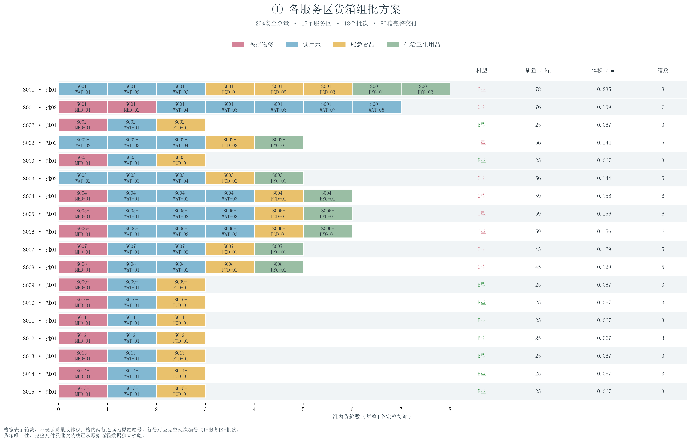
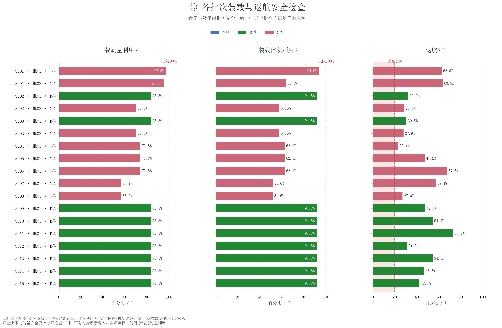
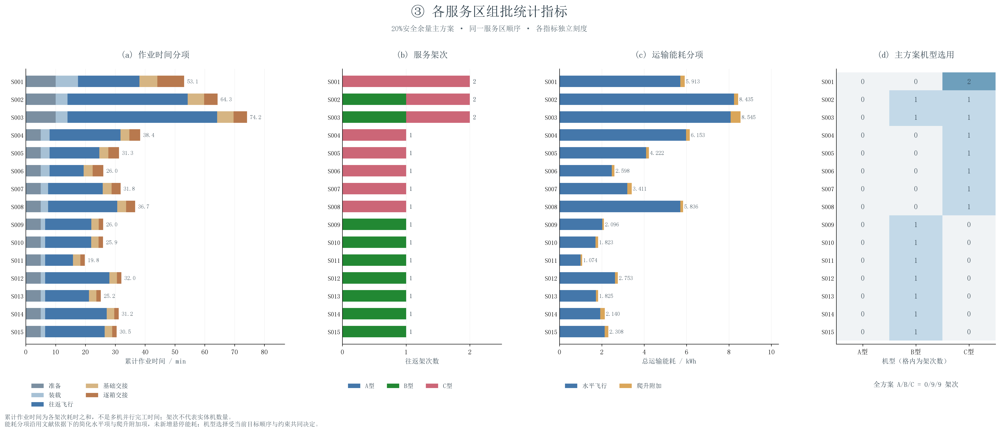
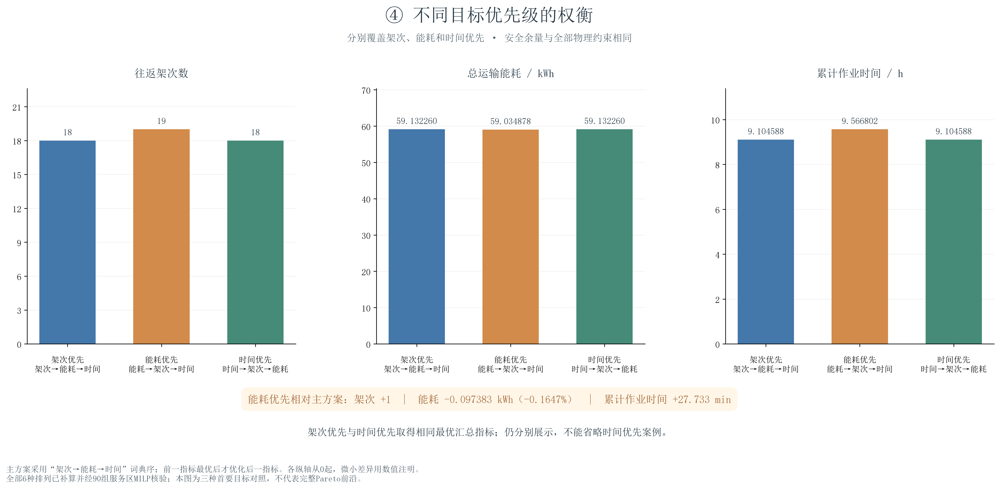
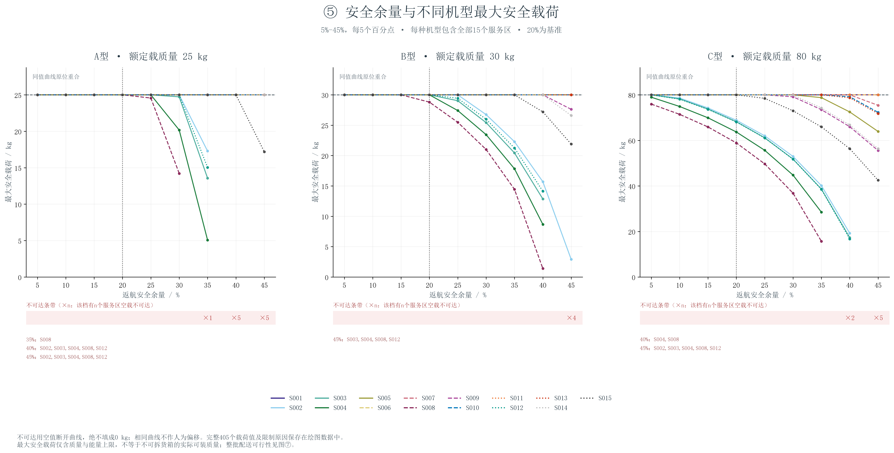
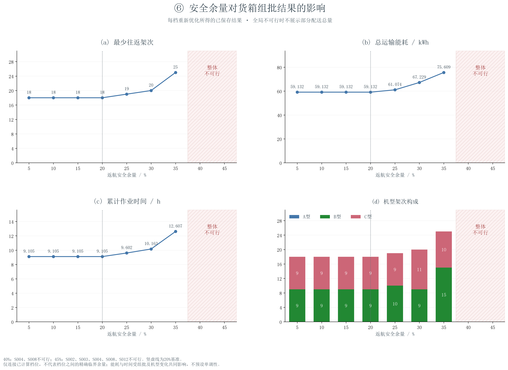
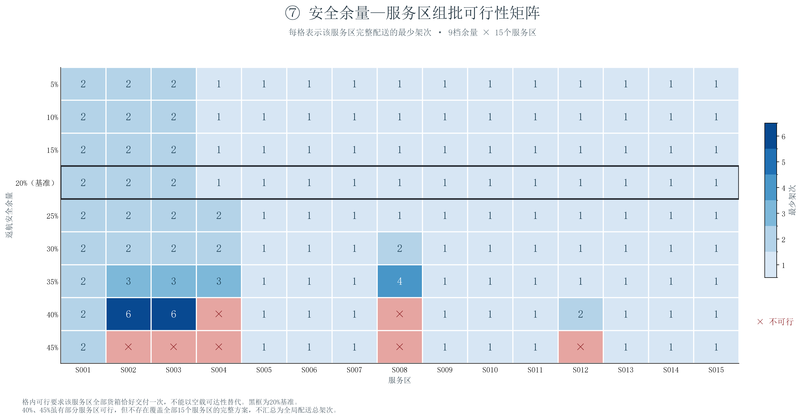

# 问题一核心图册与重绘说明

7组图对应具体组批、约束检查、服务区成本、目标权衡及安全余量影响。每图含300 dpi PNG和矢量PDF；没有重新运行优化。

## 复现入口

`python scripts/plot_q1_core.py`

只使用已保存绘图数据重绘（不读取原始附件、不运行优化）：
`python scripts/plot_q1_core.py --from-bundle outputs/q1_core_figures/data/plot_data.json --output outputs/q1_core_redraw`

图册内code目录同时保存两份代码副本及重绘依赖清单。迁移后可用配套Python/独立环境执行code/plot_q1_core.py，以--from-bundle指定JSON绝对路径、--output指定输出绝对路径、--font指定可用中文字体。
例如：`python code/plot_q1_core.py --from-bundle D:/path/data/plot_data.json --output D:/path/redraw --font C:/Windows/Fonts/msyh.ttc`。无字体时明确报错，不静默生成缺字图。

## 数据与口径

data/plot_data.json为全部7图的数值快照，包含原始80箱属性、3种机型参数、来源哈希及绘图明细；7个CSV与JSON逐字段核对一致。空值表示不可达或不可行，不能改成零。CSV只是数值明细，绘图以JSON为统一数据源。
01：80个货箱格，横轴单位为箱数；02：18批次质量/额定质量、体积/额定体积与返航SOC；03：15区作业时间5分项、能耗2分项及A/B/C架次。
04：主图覆盖架次、能耗、时间三种首要目标，CSV保留全部6种排列。时间优先与架次优先汇总指标相同；能耗优先为19架次，少耗约0.1647%能量、多用约27.733分钟。
05：405个“9档余量×15区×3机型”最大安全载荷；不可达只指空载往返不可行。06：9档整体指标，40%、45%整体不可行。07：135个局部服务区可行性格，以完整逐箱交付判定。
水平/爬升能耗是已有文献依据下的简化模型值，未实测标定；引用docs/公式来源与假设审计.md及references/运输能耗公式专项核查.md。统计指标为已有结果直接汇总或无量纲比值，不新增优化或物理假设。
累计作业时间不是多机并行完工时间；架次不是实体机数量；有限目标对照不是完整Pareto前沿。机型矩阵反映当前主方案选择，不代表某种机型无条件最优。

## 核验

源码模式核对原始输入与已保存结果哈希，使用完整DEM复核航段；从原始逐箱属性独立重算全部对照及余量情景，并重新核对405个安全载荷值。18架次80箱、758 kg、2.011 m³保持一致；分项逐批次/逐区/全局守恒。
快照重绘模式检查快照哈希及各表一致性，不宣称重新核对了不可获得的原始附件。所有输出带代码、字体、依赖版本和数据哈希日志。PNG/PDF渲染检查另记logs/export_checks.json。

## 01_各服务区货箱组批方案

## 02_批次装载与返航安全

## 03_各服务区组批统计

## 04_目标优先级权衡

## 05_安全余量与最大安全载荷

## 06_安全余量与组批结果

## 07_安全余量与服务区可行性

