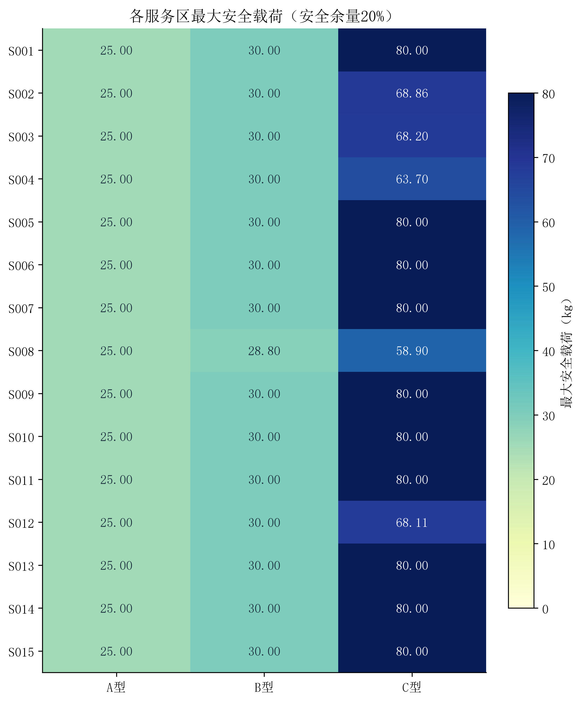
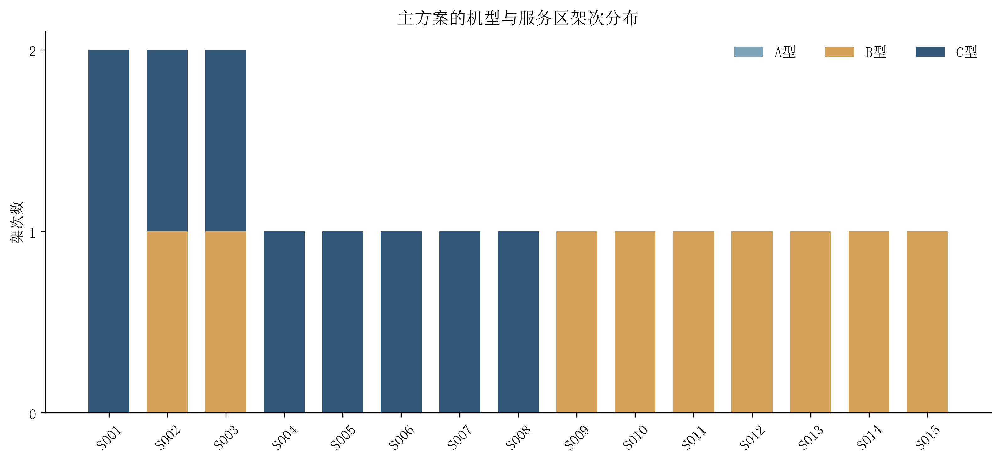
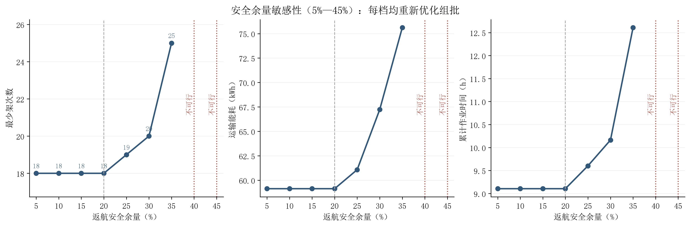
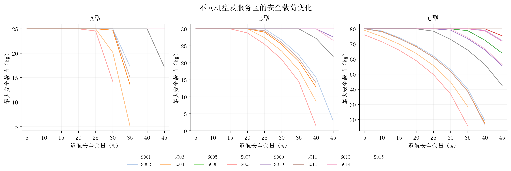

# 问题一计算结果分析

采用架次、能耗、累计作业时间的词典序目标。在20%安全余量下，80箱物资全部交付，主方案共18架次，总运输能耗59.132260 kWh，累计作业时间32776.517秒（9.104588小时）。

机型架次为A型0次、B型9次、C型9次。累计作业时间是各架次作业耗时相加，不是考虑多机并行后的任务完工时刻。问题一也不限制实体机库存，因此架次数不代表需要同时配置的无人机数。

## 1 安全载荷与组批

| 机型 | 最小安全载荷kg | 最大安全载荷kg | 受能量约束的服务区 |
|---|---:|---:|---|
| A | 25.000000 | 25.000000 | 无 |
| B | 28.801360 | 30.000000 | S008 |
| C | 58.904166 | 80.000000 | S002、S003、S004、S008、S012 |

质量与体积给出的架次下界为18：S001、S002、S003各至少2次，其余12个区各至少1次。主方案达到该下界，因此18架次的第一层目标也有直接的下界证明。

每个候选批次均同时验证质量、体积和往返能量。安全载荷是连续质量上限，不能将其直接理解为某种货箱的实际可装质量。

## 2 多目标优先级对比

| 优先级 | 架次数 | 能耗kWh | 累计作业小时 | A/B/C架次 |
|---|---:|---:|---:|---|
| 架次→能耗→时间 | 18 | 59.132260 | 9.104588 | 0/9/9 |
| 架次→时间→能耗 | 18 | 59.132260 | 9.104588 | 0/9/9 |
| 能耗→架次→时间 | 19 | 59.034878 | 9.566802 | 0/11/8 |

能耗优先方案相对主方案增加1架次，节能0.097383 kWh（0.1647%），增加累计作业时间27.733分钟。该对照量化了优先减少架次的代价。

对照仅改变目标优先关系，不改变物理与装载约束。这三组方案不是完整Pareto前沿。主方案体现先减少往返任务组织次数，再控制能耗的偏好。

## 3 安全余量敏感性

| 安全余量 | 可行性 | 最少架次 | 能耗kWh | 累计作业小时 | A/B/C架次 |
|---|---|---:|---:|---:|---|
| 5% | 可行 | 18 | 59.132260 | 9.104588 | 0/9/9 |
| 10% | 可行 | 18 | 59.132260 | 9.104588 | 0/9/9 |
| 15% | 可行 | 18 | 59.132260 | 9.104588 | 0/9/9 |
| 20% | 可行 | 18 | 59.132260 | 9.104588 | 0/9/9 |
| 25% | 可行 | 19 | 61.074311 | 9.601711 | 0/10/9 |
| 30% | 可行 | 20 | 67.228732 | 10.162968 | 0/9/11 |
| 35% | 可行 | 25 | 75.608929 | 12.606724 | 0/15/10 |
| 40% | 不可行：S004,S008 | — | — | — | — |
| 45% | 不可行：S002,S003,S004,S008,S012 | — | — | — | — |

40%余量下不可行的直接原因：S004的饮用水；S008的医疗物资；S008的应急食品；S008的生活卫生用品；S008的饮用水无法用任何机型进行单箱往返配送。能耗随载荷不减，增加同批货箱不会恢复可行性，因此这不是算法未找到方案。各机型的单箱能耗与预算见Excel“不可行情景诊断”。

45%余量下不可行的直接原因：S002的医疗物资；S002的应急食品；S002的生活卫生用品；S002的饮用水；S003的医疗物资；S003的应急食品；S003的生活卫生用品；S003的饮用水；S004的医疗物资；S004的应急食品；S004的生活卫生用品；S004的饮用水；S008的医疗物资；S008的应急食品；S008的生活卫生用品；S008的饮用水；S012的医疗物资；S012的应急食品；S012的饮用水无法用任何机型进行单箱往返配送。能耗随载荷不减，增加同批货箱不会恢复可行性，因此这不是算法未找到方案。各机型的单箱能耗与预算见Excel“不可行情景诊断”。

安全余量增加会收缩可行域，最大安全载荷不增、最少架次不减。能耗和作业时间受组批及机型切换共同影响，不要求单调。表中仅列离散采样情景，不能据此声称确定了全部精确临界余量。

## 4 可行性与最优性核验

- 全部80个货箱唯一交付；质量758 kg、体积2.011 m³；每架次仅服务一个服务区。
- 从逐箱原始属性独立重算载荷、体积、能耗、SOC和时间；最低返航SOC为23.089248%。
- 共644个箱数状态。动态规划遍历所有可行组成，每个服务区的主方案均经三阶段MILP复核，并取得最优终止状态。
- 最优性针对明确采用的地形、能耗、时间和目标口径；不是对所有可能物理解释均成立的结论。
- 能耗按1e-12 kWh、作业时间按1e-6 s转换为整数比较，消除浮点加法顺序影响；导出指标用未量化值重算。每个完整方案至多80架次，相应累计量化误差上界为4e-11 kWh与4e-5秒。

## 5 文件与复现

- `问题一结果.xlsx`：主方案、时间分解、最大安全载荷、目标对比、敏感性和核验结果。
- `tables/results.json`：完整结构化结果、所有对照与敏感性情景的逐箱方案、参数和输入哈希。
- `tables/*.csv`：与Excel对应的数值表；目标及余量情景的JSON保留全部组批细节。
- `logs/validation.json`：原始数据重算、MILP、敏感性、Excel和输入未修改检查。
- 工程根目录运行 `python run_q1.py --config configs/q1.toml` 可重新生成。

本问不排实体机、共享电池或交付时刻。此方案可作为后续问题的参考，不能直接宣称满足问题二的时限与资源约束。
