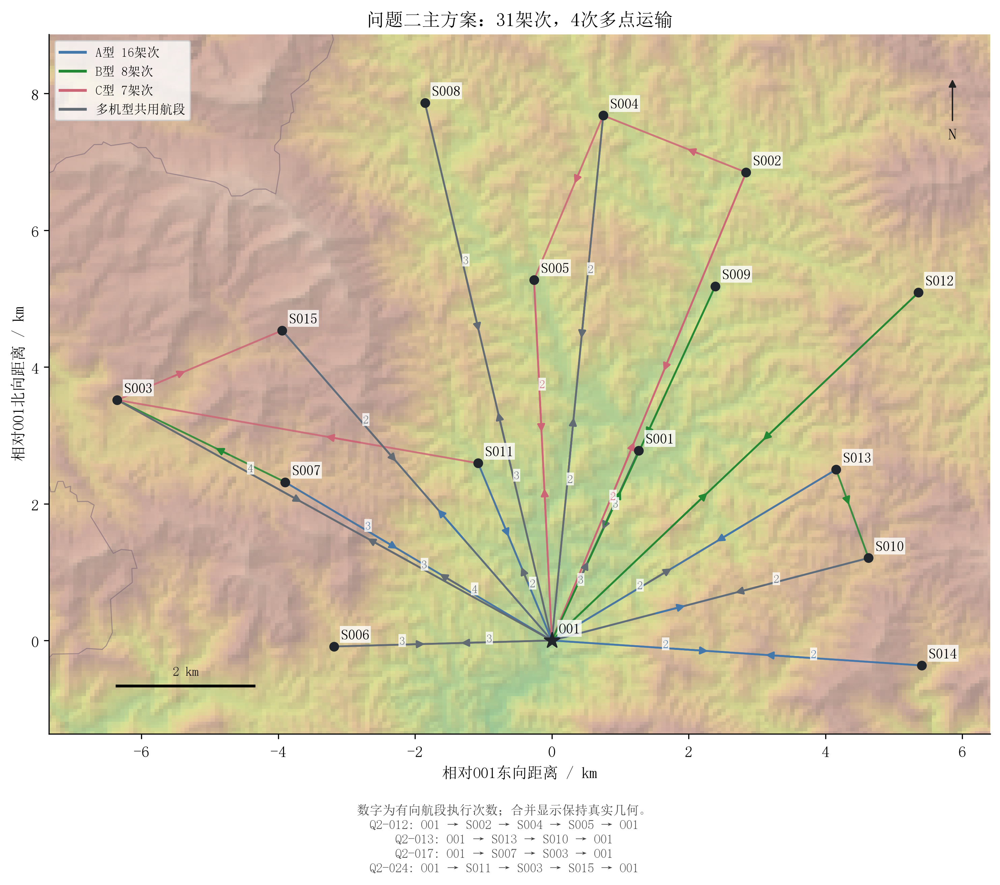
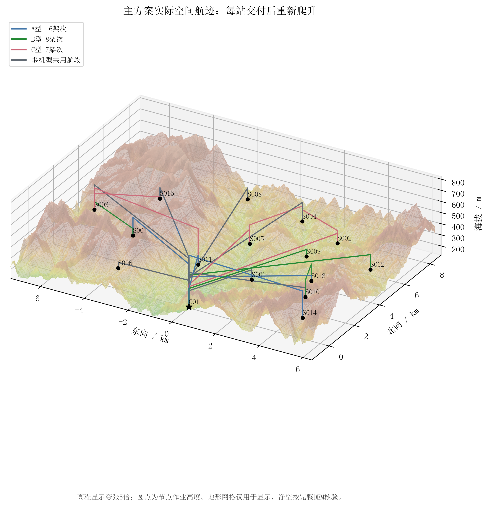
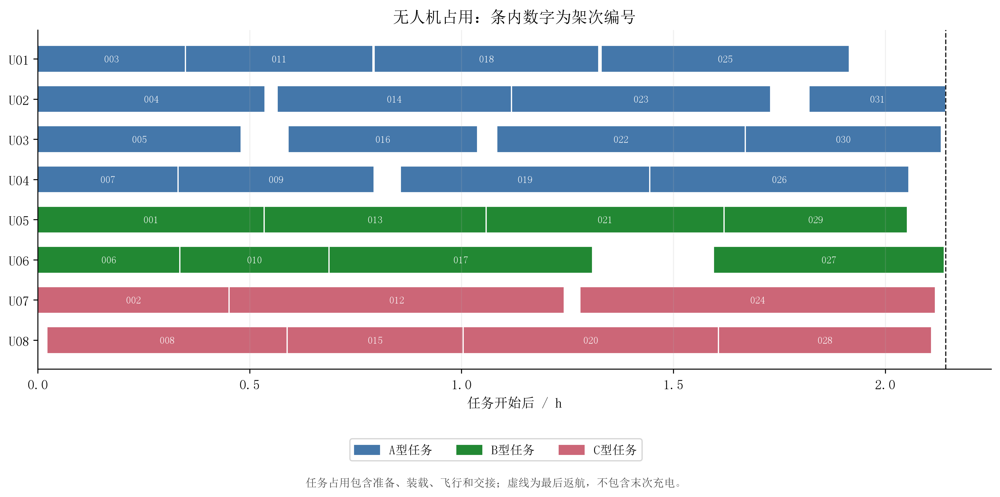
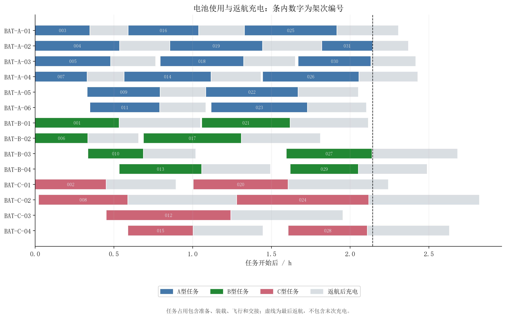
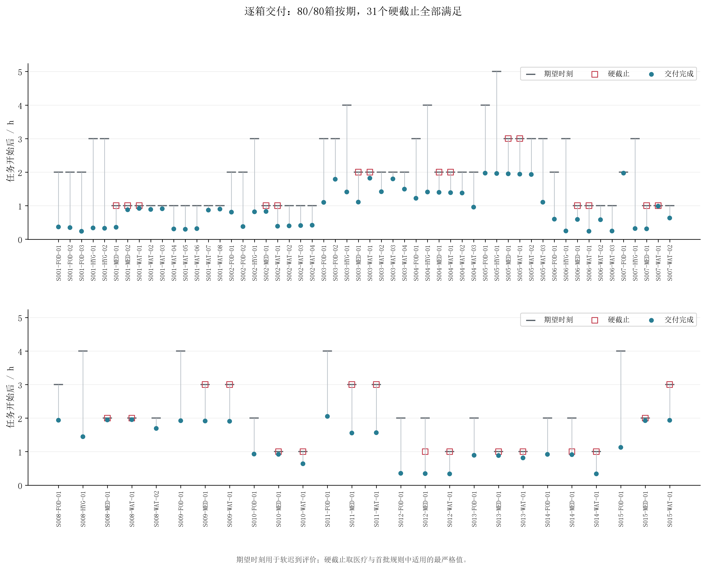
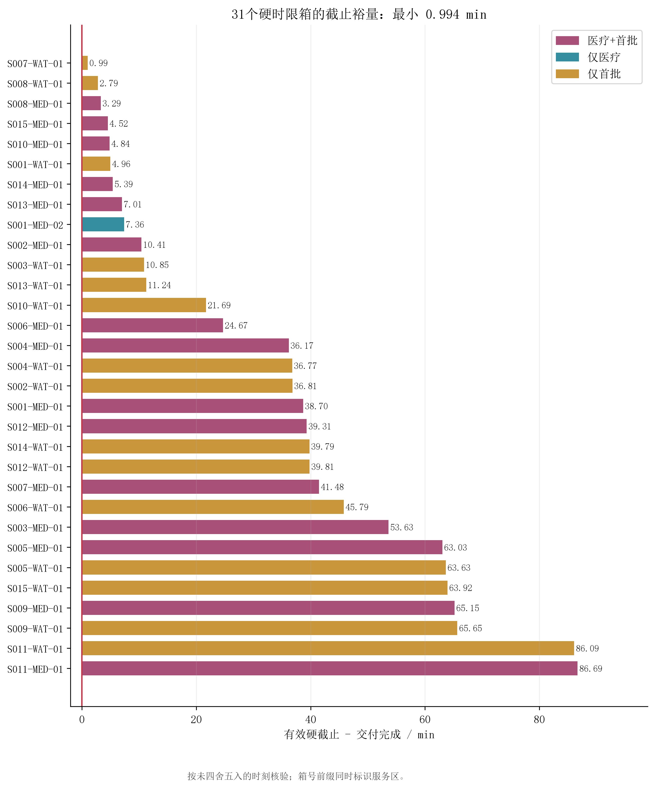
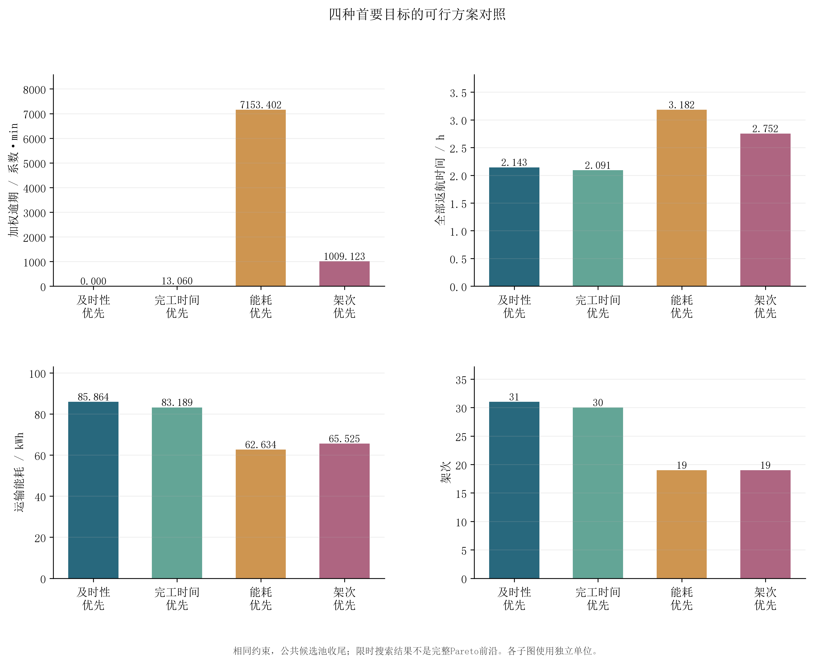
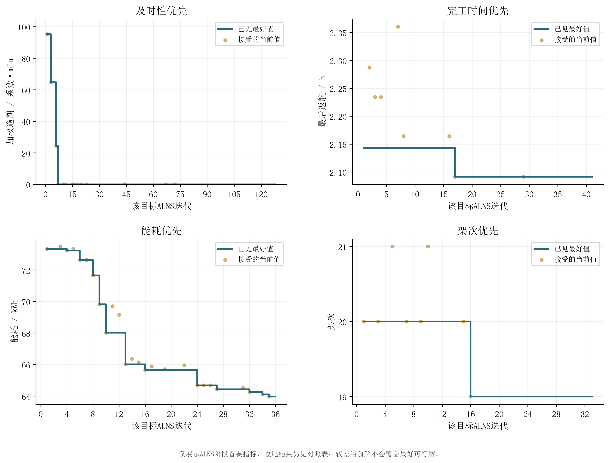

# 问题二：多点运输与机电资源联合调度结果

## 1 推荐方案与题目任务

主方案按“加权逾期→全部返航时间→能耗→架次”的词典序选择。在20%返航安全余量下，80箱、758kg、2.011m³全部交付，安排 **31架次**，其中多点架次 **4次**。

- 加权逾期：**0.000系数·秒**；80/80箱在期望时刻前交付。
- 全部任务完成：**7715.162秒（2.143101小时）**，取最后一架运输机返回O01的时刻。
- 总运输能耗：**85.864101kWh**；最低返航SOC：**20.132910%**。
- A/B/C机型架次：**16/8/7**；使用8架实体机、14组不同电池。
- 31个硬时限箱全部满足；最紧箱为 **S007-WAT-01**，截止裕量 **0.994367分钟**。

架次数不等于实体机数。累计作业时间为15.979612小时，表示全部架次占用时间之和，与并行调度的最后返航时刻不同；末次充电不计入任务完成时间。

## 2 四指标的优先关系与实际权衡

| 首要目标 | 加权逾期/系数·s | 最后返航/h | 能耗/kWh | 架次 | 按期箱数 | A/B/C架次 |
|---|---:|---:|---:|---:|---|---|
| 及时性优先 | 0.000 | 2.143101 | 85.864101 | 31 | 80/80 | 16/8/7 |
| 完工时间优先 | 783.576 | 2.091271 | 83.189040 | 30 | 79/80 | 15/8/7 |
| 能耗优先 | 429204.104 | 3.181628 | 62.634022 | 19 | 65/80 | 0/11/8 |
| 架次优先 | 60547.406 | 2.751864 | 65.525212 | 19 | 78/80 | 2/9/8 |

- 完工时间优先相对主方案：加权逾期变化+783.576系数·秒，最后返航变化-3.110分钟，能耗变化-2.675061kWh（-3.115%），架次变化-1。
- 能耗优先相对主方案：加权逾期变化+429204.104系数·秒，最后返航变化+62.312分钟，能耗变化-23.230079kWh（-27.054%），架次变化-12。
- 架次优先相对主方案：加权逾期变化+60547.406系数·秒，最后返航变化+36.526分钟，能耗变化-20.338890kWh（-23.687%），架次变化-12。

推荐及时性优先方案的依据是救援任务中先减少加权迟到，再在该指标下缩短全部任务完成时间；这是明确采用的决策偏好，不是原题唯一规定。能耗、架次分别优先的结果展示其他偏好的实际代价，相同指标也如实保留。

四种方案均满足同样的物理约束与硬截止。搜索共享已发现候选及可行方案，最终在同一个1500候选公共池内分层收尾。主方案获得的搜索时间较多，限时结果差异可能同时来自目标偏好与求解进度，因此这些结果不是完整Pareto前沿，也不作为目标冲突的精确理论边界。

## 3 路线、逐箱交付和资源使用

`问题二结果.xlsx`的“Q2_运输架次”给出实体机、电池、准备开始、访问路线、返回时刻与能耗；“Q2_逐箱交付”给出全部80箱的完成时刻，并保持原模板列名及顺序。附表完整列出每批货箱、装载量、逐段剩余载荷、交箱顺序、硬截止与裕量。

实体机从准备开始到返航占用，电池在返航后继续充电，充满才可再次用于同型无人机。不同电池允许并行充电，模型没有添加题目未给的充电器限制。每个资源编号均独立检查区间不重叠，释放与下一任务开始时刻相等时允许复用。

各对照方案完整结果保存在 `tables/by_scheme/`，并在Excel补充表中提供对照运输安排与逐箱交付。JSON还包含全部飞行、基础交接、逐箱交接的阶段时间线，可供问题三继续使用。

主方案逐机使用统计如下。最后返航从任务起点计时，累计占用是该实体机所有任务占用时长之和；一组同型电池可在不同无人机之间复用，因此最后一列不能直接跨机相加。

| 无人机 | 机型 | 架次 | 累计占用/min | 最后返航/min | 使用过的电池组数 |
|---|---|---:|---:|---:|---:|
| U01 | A | 4 | 114.470 | 114.946 | 3 |
| U02 | A | 4 | 121.426 | 128.586 | 3 |
| U03 | A | 4 | 118.637 | 127.966 | 3 |
| U04 | A | 4 | 119.665 | 123.373 | 3 |
| U05 | B | 4 | 123.142 | 123.142 | 2 |
| U06 | B | 4 | 111.274 | 128.387 | 2 |
| U07 | C | 3 | 124.891 | 127.104 | 3 |
| U08 | C | 4 | 125.271 | 126.571 | 3 |

全部68条实际航段均已复核。多点运输的访问次序如下，单点路线及全部精确开始、返航、充满时刻见Excel与逐方案CSV。

| 架次 | 无人机 | 访问顺序 | 货箱数 |
|---|---|---|---:|
| Q2-012 | U07 | O01 → S002 → S004 → S005 → O01 | 5 |
| Q2-013 | U05 | O01 → S013 → S010 → O01 | 3 |
| Q2-017 | U06 | O01 → S007 → S003 → O01 | 3 |
| Q2-024 | U07 | O01 → S011 → S003 → S015 → O01 | 6 |

## 4 算法记录与证明范围

正式配置预算60.0分钟，本次搜索记录用时60.040分钟，导出和核验另计。共有238次ALNS迭代，接受56次，其中16次为相对当前状态较差的可行方案。算子权重、温度、接受概率和每次求解状态均已保存。

- 及时性优先：tardiness: OPTIMAL_BY_ZERO_LOWER_BOUND；makespan: FEASIBLE；energy: FEASIBLE；sorties: FEASIBLE；最终解来源 `tardiness:alns:72`。
- 完工时间优先：makespan: FEASIBLE；tardiness: FEASIBLE；energy: FEASIBLE；sorties: FEASIBLE；最终解来源 `makespan:alns:29`。
- 能耗优先：energy: OPTIMAL；tardiness: FEASIBLE；makespan: FEASIBLE；sorties: FEASIBLE；最终解来源 `energy:final`。
- 架次优先：sorties: FEASIBLE；tardiness: FEASIBLE；makespan: FEASIBLE；energy: FEASIBLE；最终解来源 `sorties:final`。

以上状态属于对应候选池、邻域限制及固定前级目标。若前一级限时未证最优，后续阶段只在当前固定值下优化。跨目标搜索可更新其他方案，因此不能把该方案最后一次收尾状态直接当作最终采用解的最优证书。

原问题有严格松弛下界W≥0、N≥ceil(758/80)=10；架次下界忽略了能量、体积、时限及资源，通常较弱。本次主方案W=0，第一指标达到原问题零下界；其余指标仍不宣称全局最优。

每架次同一服务区至多访问一次，最多15区，不设两站或三站上限。有限候选搜索仍可能遗漏更好的路线，因此结论为当前物理解释、搜索范围和预算下经核验的可行方案。

## 5 来源、精度和独立核验

水平能耗参考Zhang等(2021，DOI:10.1016/j.trd.2020.102668)附录A式(A1)的电池能量/航程折算；爬升附加项参考附录C式(C1)的势能功率分量，经积分及题给效率折算。全可用电量标定、仅保留势能附加项属于简化假设，未实测校准，详见模型说明与公式审计。

四种方案均从原始逐箱数据独立重算。主方案毫秒保守飞行裕量累计0.038604秒，能耗缓存与复算的最大差为0kWh。1毫秒时序下不放宽截止，能耗目标量化为1e-9kWh，物理约束和导出值使用未量化能耗。

输入、配置、依赖、种子、计算代码和导出代码哈希均保留。原始附件、问题一输出和论文工程按哈希检查保持原状。固定种子不能消除墙钟限时受机器速度的影响，完整方案可独立复核，不承诺跨机器逐位相同。

## 6 复现

```powershell
python run_q2.py --config configs/q2.toml
python run_q2.py --verify-only
python run_q2.py --report-only
python scripts/plot_q2.py --from-bundle outputs/q2/plotting/data/plot_data.json --output outputs/q2_redraw
```

`--resume`只读取显式指定输出目录的兼容检查点；`--solve-only`保存计算结果，之后使用`--report-only`导出。重新完整运行会归档同名旧结果。`--budget-seconds`用于短时测试，不代表正式预算。

## 7 图册
















