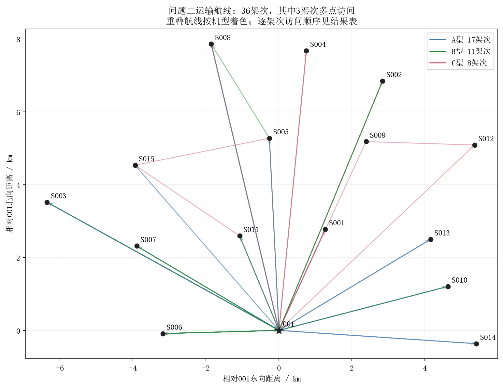
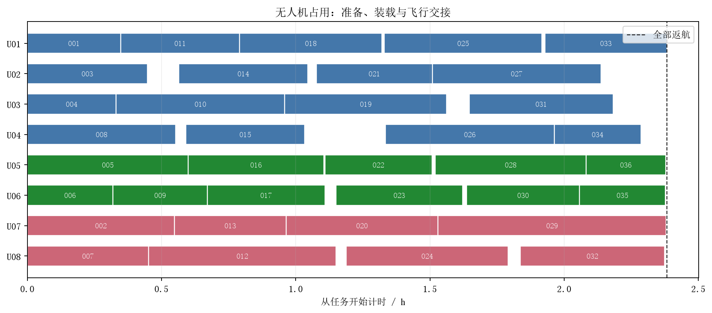
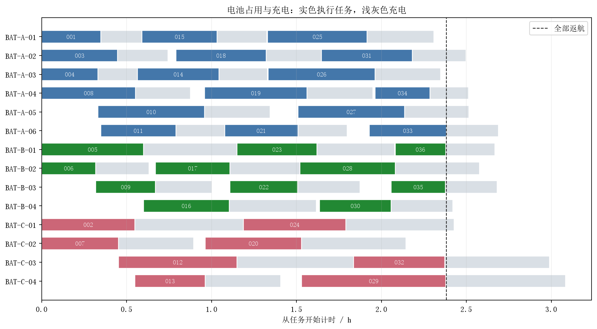
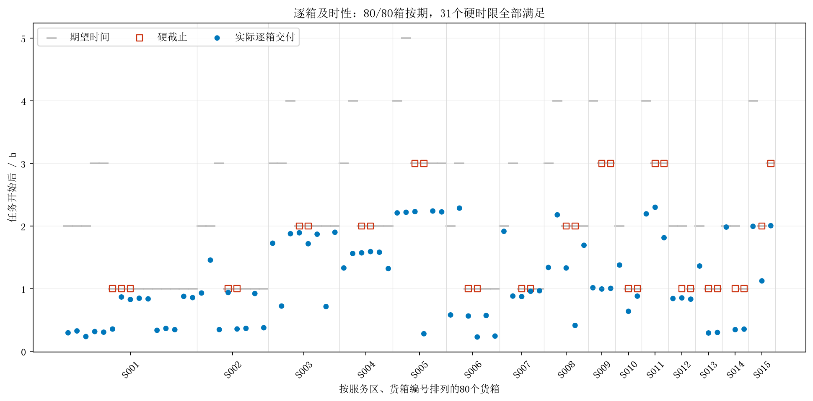

# 问题二计算结果与分析

## 1 主方案

在20%返航安全余量下，完成80箱、758 kg、2.011 m³交付。主方案共**36架次**，其中**3架次多点访问**；最后返航时刻为**8575.814秒（2.382171小时）**，运输能耗**95.845699 kWh**。

31个医疗/首批硬时限箱全部按时。按全部货箱的期望时间评价，80箱按期、0箱逾期，应急优先系数加权逾期为0.000系数·秒。机型构成为A/B/C = 17/11/8架次，使用8架实体机、14组不同电池，最低返航SOC为21.538230%。

“开始时刻”是准备开始；“逐箱交付完成”按实际交接顺序逐箱累加。全部返航时间不包含末次充电。累计作业时间为17.745812小时，是各架次占用时间之和，与多机并行的最终完成时间不同。

## 2 目标对照

| 方案 | 加权逾期（系数·秒） | 最后返航h | 能耗kWh | 架次 | 多点架次 |
|---|---:|---:|---:|---:|---:|
| 初始调度 | 0.000 | 2.715069 | 98.006952 | 38 | 3 |
| 及时性优先 | 0.000 | 2.382171 | 95.845699 | 36 | 3 |
| 完工时间优先 | 0.000 | 2.382171 | 95.845699 | 36 | 3 |

对照在相同最终候选池上重新安排交箱顺序和资源时序；计算预算有限，差异同时受目标顺序与求解进度影响，不能将全部差值解释为精确Pareto权衡。

最终主方案未被对照搜索中的方案改善。

## 3 可行性与最优性边界

- 从原始逐箱质量、体积、时限与机型数据独立重算，货箱唯一交付、装载、逐段能耗、SOC、交接时间及资源占用检查全部通过。
- 最终候选池含1500个候选。主方案收尾阶段状态：tardiness：OPTIMAL_BY_ZERO_LOWER_BOUND；makespan：FEASIBLE；energy：FEASIBLE；sorties：FEASIBLE。每一状态仅适用于该次候选池和已固定的前级目标；限时阶段不代表证明最优。
- 原问题加权逾期下界为0；当前值为0.000。总质量给出架次数下界10，该下界未考虑地形、体积、时间和资源，因此较弱；主目标并非先最少架次。
- 每架次同一服务区至多访问一次，候选搜索不限制为两站或三站，但有限候选池可能遗漏更优方案。因此不宣称完整问题的全局最优。
- 主方案全部航段的毫秒向上取整裕量累计0.040623秒；逐箱与资源验证均使用保守时序。能耗目标量化为1e-9 kWh，报告能耗按未量化公式重算。
- 固定种子、单求解线程、候选排序及配置均已记录。限时求解会受机器速度影响；保存的逐箱方案可直接复核，但不承诺跨机器逐位相同。

## 4 航线与资源可视化

## 5 复现与交付

工程根目录执行 `python run_q2.py --config configs/q2.toml`。默认求解预算30分钟（建模、导出等开销另计），预算是上限，提前最优终止可更快。`--test`运行问题一与问题二回归检查；`--report-only`可从已保存结果重新生成报告、图表和Excel。

本次记录的求解预算为20.0分钟。本次从已验证的可行检查点继续搜索，进入本轮前的方案和求解记录保存在logs/resumed_from.json。 `python run_q2.py --verify-only`可独立重算保存的完整方案并核对Excel/CSV，避免依赖重新搜索取得相同结果。

结果工作簿保留原模板两张Q2表的列名顺序，并附装载、交接、逐段能耗、电池充电、无人机占用、目标对比和求解核验表。`tables/results.json`保留主方案、对照、逐阶段时间线、配置与输入哈希；`logs/solver_trace.json`保留求解状态与界限。

原始附件、问题一结果和既有论文工程保持原状。当前方案不包含通信保障，不能直接宣称满足问题三。
