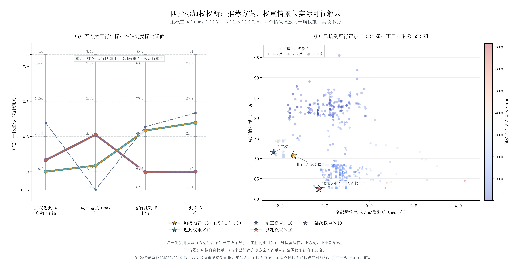

# 四指标加权权衡与推荐方案

## 1 本次采用的决策方式

用户确认 W:Cmax:E:N=3:1.5:1:0.5，对应归一化权重50%、25%、16.6667%、8.3333%。目标为F=Σα_j(f_j−l_j)/s_j，越小越好。该权重是显式偏好；货箱优先系数w_b仅用于W，不等同于四目标权重。硬截止始终为约束。

归一化范围在新搜索开始前取旧四种词典序方案的最小/最大值并冻结；新解超出范围不裁剪。它们是已见方案比较尺度，不是全局最优/最差界限。

| 指标 | 固定下端 | 固定上端 | 固定跨度 | 主权重 |
|---|---:|---:|---:|---:|
| 及时性W | 0.000000 | 429204.104000 | 429204.104000 | 50.000000% |
| 完工时间Cmax | 7528.576000 | 11453.859000 | 3925.283000 | 25.000000% |
| 运输能耗E | 62.634022 | 85.864101 | 23.230079 | 16.666667% |
| 架次N | 19.000000 | 31.000000 | 12.000000 | 8.333333% |

## 2 计算结果与权衡

| 方案 | W/系数·秒 | 最终返航/h | 能耗/kWh | 架次 | 按期箱数 | 主权重统一F |
|---|---:|---:|---:|---:|---:|---:|
| 加权推荐方案 | 47.892 | 2.146654 | 70.781829 | 24 | 79/80 | 0.105933639 |
| 及时性权重放大 | 47.892 | 2.146654 | 70.781829 | 24 | 79/80 | 0.105933639 |
| 完工时间权重放大 | 179071.716 | 1.922521 | 71.535264 | 25 | 74/80 | 0.275447009 |
| 能耗权重放大 | 42218.640 | 2.433552 | 62.508335 | 19 | 77/80 | 0.126759838 |
| 架次权重放大 | 42218.640 | 2.433552 | 62.508335 | 19 | 77/80 | 0.126759838 |
| 旧词典序：及时性 | 0.000 | 2.143101 | 85.864101 | 31 | 80/80 | 0.261883602 |
| 旧词典序：完工时间 | 783.576 | 2.091271 | 83.189040 | 30 | 79/80 | 0.224775869 |
| 旧词典序：能耗 | 429204.104 | 3.181628 | 62.634022 | 19 | 65/80 | 0.750000000 |
| 旧词典序：架次 | 60547.406 | 2.751864 | 65.525212 | 19 | 78/80 | 0.242740241 |

推荐主权重评分最低的完整可行方案。当前采用来源为`scenario:makespan:2980`，F从旧方案中最好值0.224775869降至0.105933639。这次是实际加权优化，不是仅对旧方案重新排名。

主方案24架次、2个多点架次，A/B/C=10/7/7；使用8架无人机、14组电池。全部80箱完整交付，31个硬截止均满足。最低返航SOC=20.943758%。累计作业时间12.496748小时，区别于最后返航时间。

软时限情况：S001-WAT-07迟到0.067分钟。正权加权允许用一定软迟到换取其他指标改善，不能把50%及时性权重解释为保证W=0。

## 3 权重情景与统一回评

从同一加权主搜索解分别启动四个情景，只将一个指标原相对权重乘10，其余不变，再归一化。实际扰动次数为{'tardiness': 3000, 'makespan': 3000, 'energy': 3000, 'sorties': 3000}。快速ALNS从现有航线池重组批次并列表调度；不在每一轮调用CP-SAT，每个情景末尾用60秒CP-SAT精修。全程找到的可行方案均按原主权重回评，独立保留最好完整方案；不只比较四个情景终点。

搜索结束后，按各情景自己的权重交叉比较9个已保存完整方案，选出该有限集合内最好的安排。原独立搜索终点连同全部时序保存在`tables/scenario_search_endpoints.json`，回评记录见`logs/scenario_reassessment.json`。此步骤没有新增优化，也不从只有目标向量的云图记录恢复方案。

| 权重情景 | 回评采用来源 | 原独立终点的情景F | 回评后的情景F |
|---|---|---:|---:|
| 及时性权重放大 | 加权推荐方案 | 0.038273991 | 0.019351957 |
| 完工时间权重放大 | 完工时间权重放大 | -0.022393058 | -0.022393058 |
| 能耗权重放大 | 能耗权重放大 | 0.047457616 | 0.047457616 |
| 架次权重放大 | 能耗权重放大 | 0.400128230 | 0.072434193 |

若不同权重情景采用同一完整方案，图中如实显示重合曲线与共点，不人为移动数值。旧词典序方案单独标明，不能称为这四个权重情景。情景的限时结果也不能当成严格单指标最优。新计算用时16.731分钟；取整综合评分对未取整归一化分数的附加误差小于1e-6，本次采用方案差值4.12e-07。航段能耗目标还存在原1e-9kWh量化，物理约束仍按未量化值核验。

## 4 图与数据

左图为主方案与四个权重情景的平行坐标，右图为实际保存的已接受可行目标向量，保留重复接受记录，另统计不同四指标向量数。点数不等同于不同路线数；散点不是完整Pareto前沿。未保留完整时序的旧日志点不作为新增推荐方案。

`问题二结果.xlsx`包含推荐运输与逐箱安排、机电资源记录、权重设置及统一评分。修改权重只会对已保存方案重评分，不会在Excel中自动重新调度。完整JSON、逐方案CSV、真实解云CSV、独立绘图代码和数据一并保留。所有新方案已从原始输入独立重算。

复现：`python run_q2_weighted.py --config configs/q2_weighted.toml`；仅重导出：`python run_q2_weighted.py --report-only`。未读取或核对检查点。

当前结论只适用于已审计物理解释、固定归一化、指定权重及候选搜索范围。权重与尺度共同决定交换关系，不宣称原问题全局最优。
