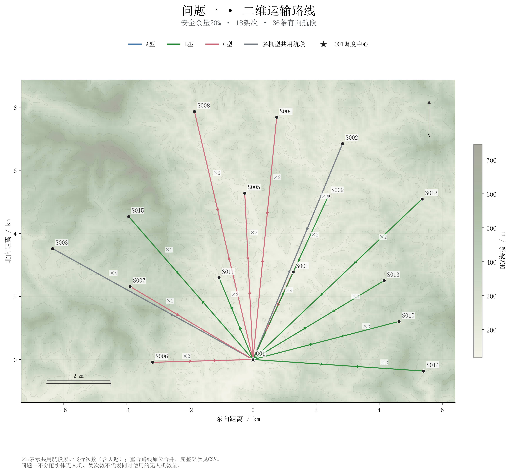
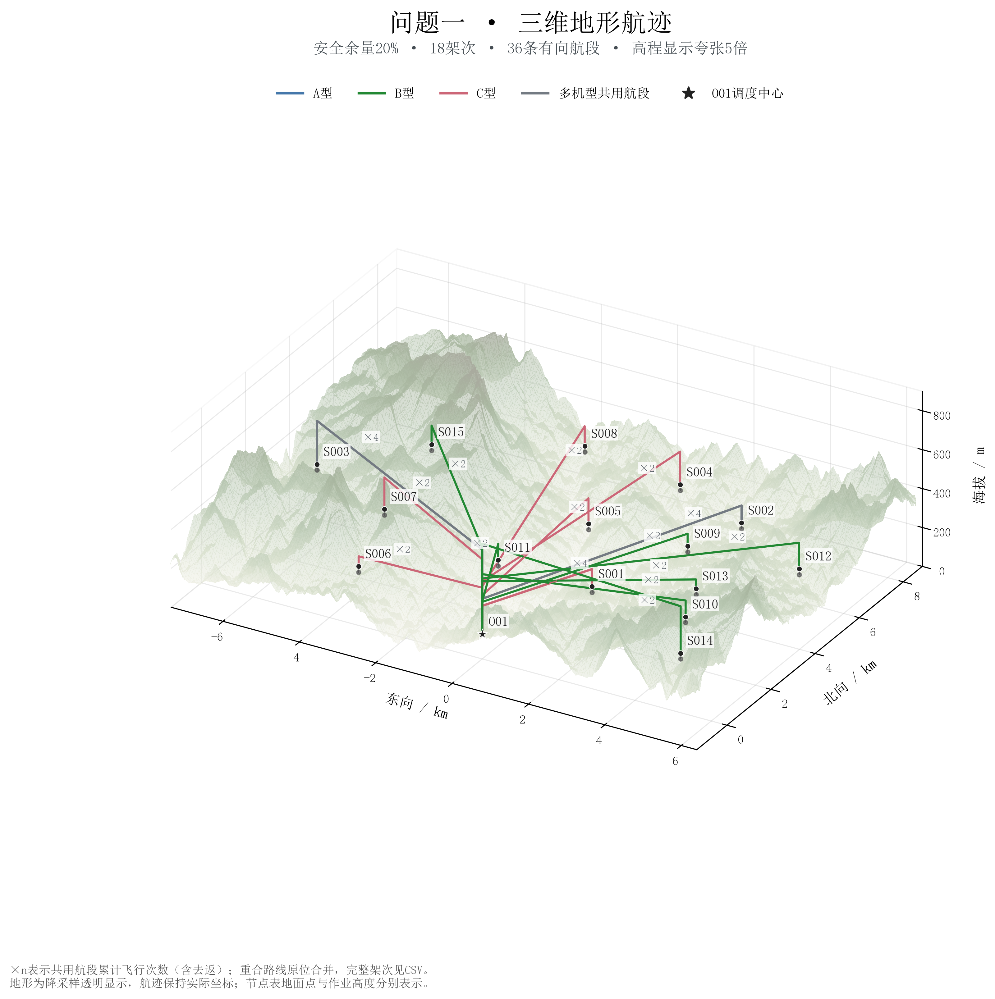
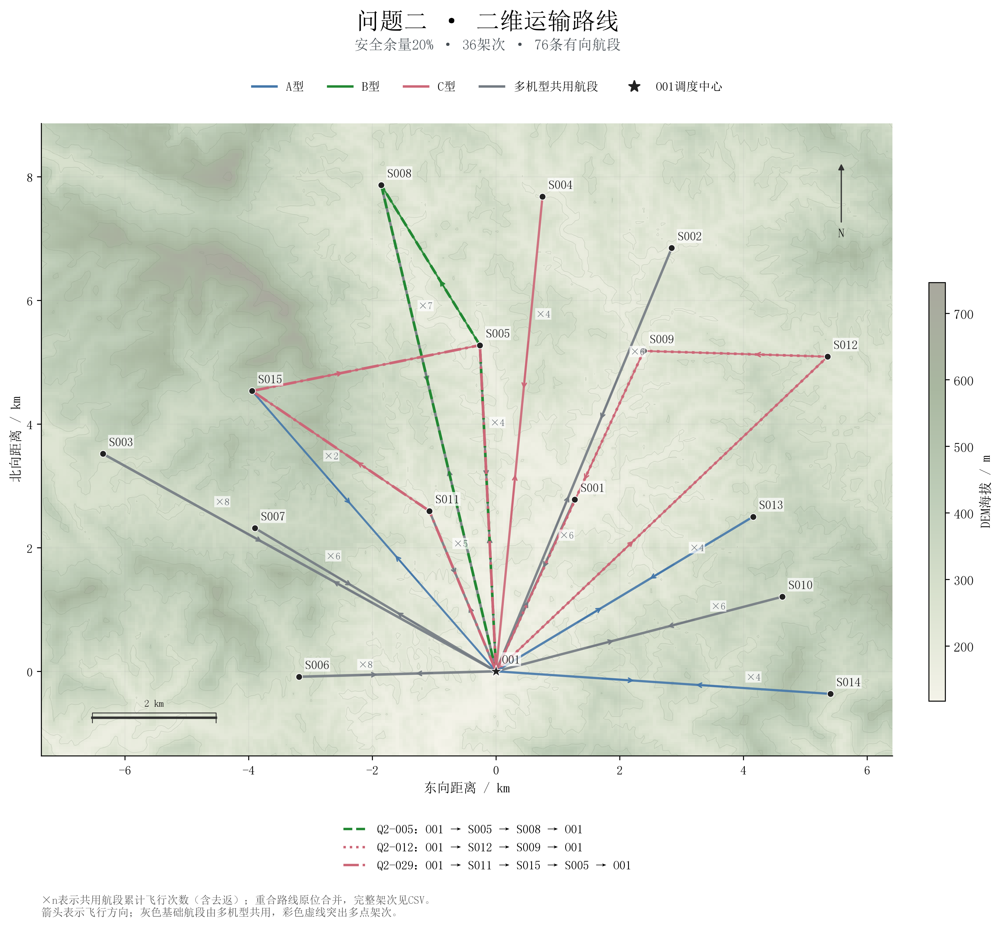
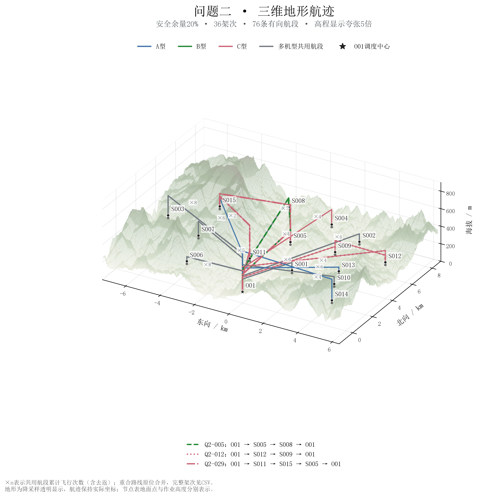
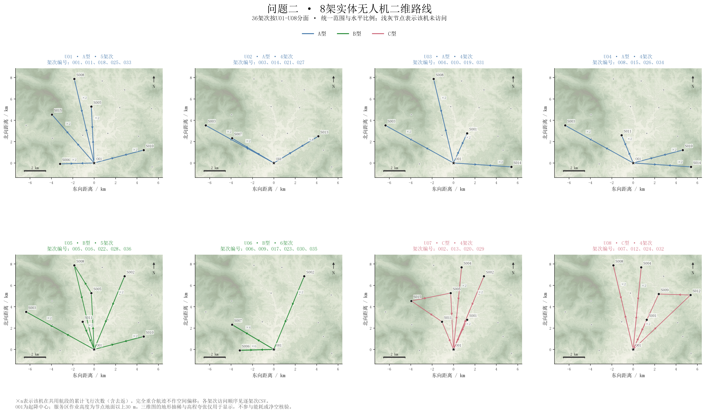
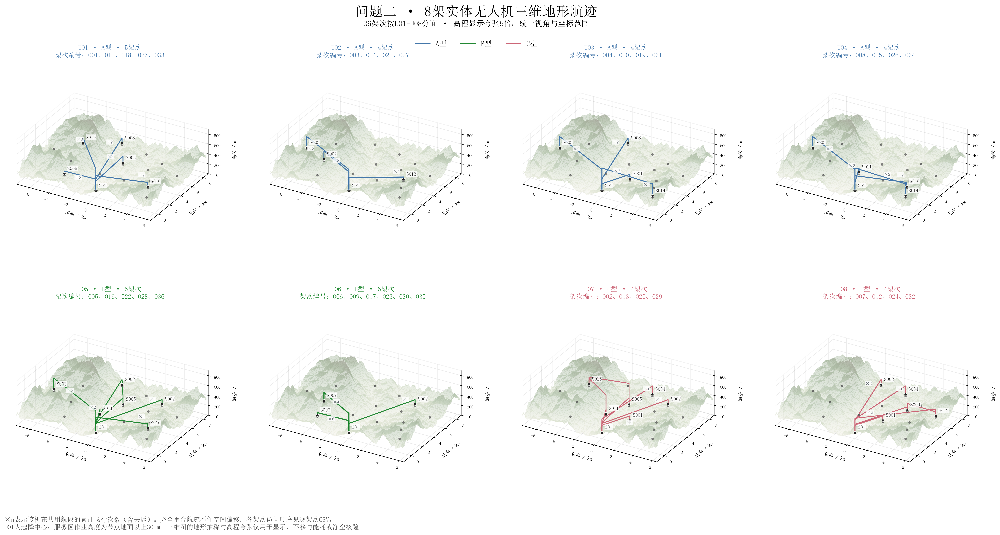

# 无人机二维与三维路线图

问题一18架次、36条有向航段；问题二36架次、76条有向航段，使用U01—U08。均采用20%安全余量的已保存主方案，没有重新优化。

## 图示口径

二维坐标沿用WGS84局部平面，以O01为原点，水平单位km；所有地图范围为节点包围盒四周扩展1 km。三维顶点的高程单位m。
每段四顶点为起点作业高度、起点上方巡航高度、终点上方巡航高度、终点作业高度。由既有航段与节点定义直接构造，无新增能耗公式。服务区作业高度为节点表海拔加30 m，O01使用节点表海拔。
三维采用仰角28°、方位角−60°和正交投影；高程显示夸张5倍，物理高程和CSV未缩放。轴盒比例按水平km与高程m换算后设置。
地形展示使用最多240×240栅格，三维总览200×200以内、分面85×85以内；降采样不参与几何与净空计算。地形透明显示，航线置于其前景以便检查路线；图像可见性不是避障证明。完整原始DEM的所有相交闭像元用于巡航高度复核。
节点表地面点与DEM分别显示，不强行改平地形。完全重合的航段原位合并；×n为累计飞行次数，含双向，不是架次数。多机型共用基础航段为灰色，其他颜色沿用A蓝/B绿/C玫红。
问题二总览用不同虚线突出3个多点架次，并列出完整访问顺序；问题一不分配实体无人机，不能将18架次理解为18架实体机。各分面仅标注该机访问节点，完整架次均保留在CSV。

## 复现与核验

`python scripts/plot_routes.py`

真实高程比例版本可另存：`python scripts/plot_routes.py --z-exaggeration 1 --output outputs/routes_true_scale`。
逐航段航程、巡航高度、爬升下降与原结果核对，绝对容差1e-6 m；验证逐架次连续性、二维投影与三维水平坐标一致，以及合并计数守恒。CSV保留全部112条航段、448个顶点及54个架次的原始精度数据。日志记录来源哈希、依赖版本与受保护文件核验。
地图显示与坐标比例属于已有模型结果的几何重建和展示选择，见公式来源审计中的路线可视化补充；不增加地形、性能或能量假设。

## 01_问题一二维路线总览

## 02_问题一三维地形航迹

## 03_问题二维路线总览

## 04_问题二三维地形航迹

## 05_问题二分无人机二维路线

## 06_问题二分无人机三维航迹

