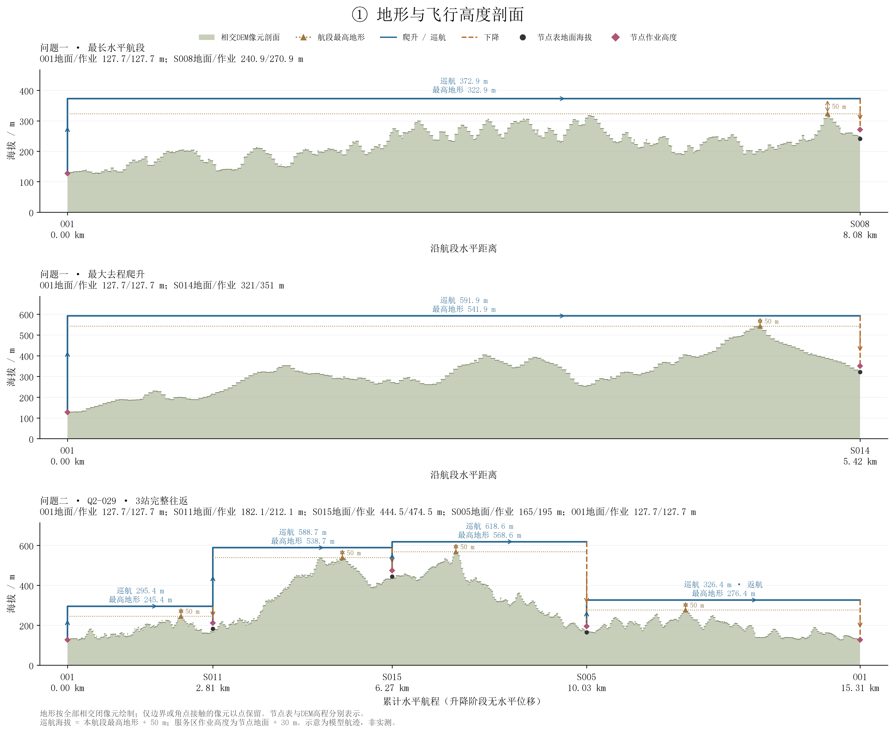
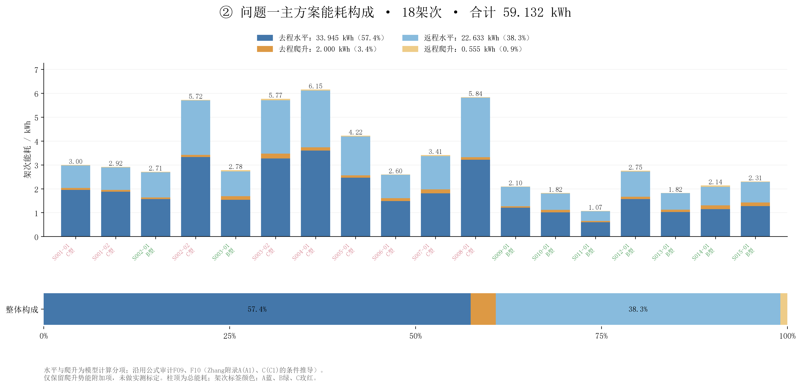
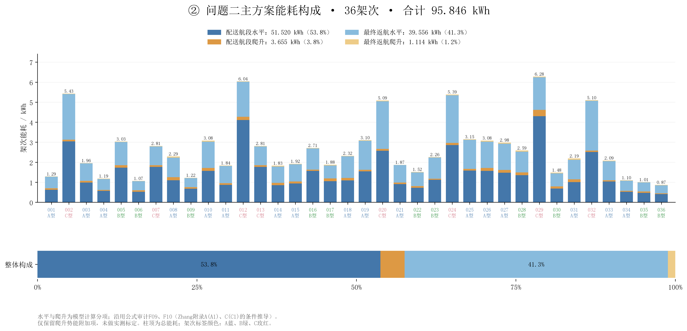
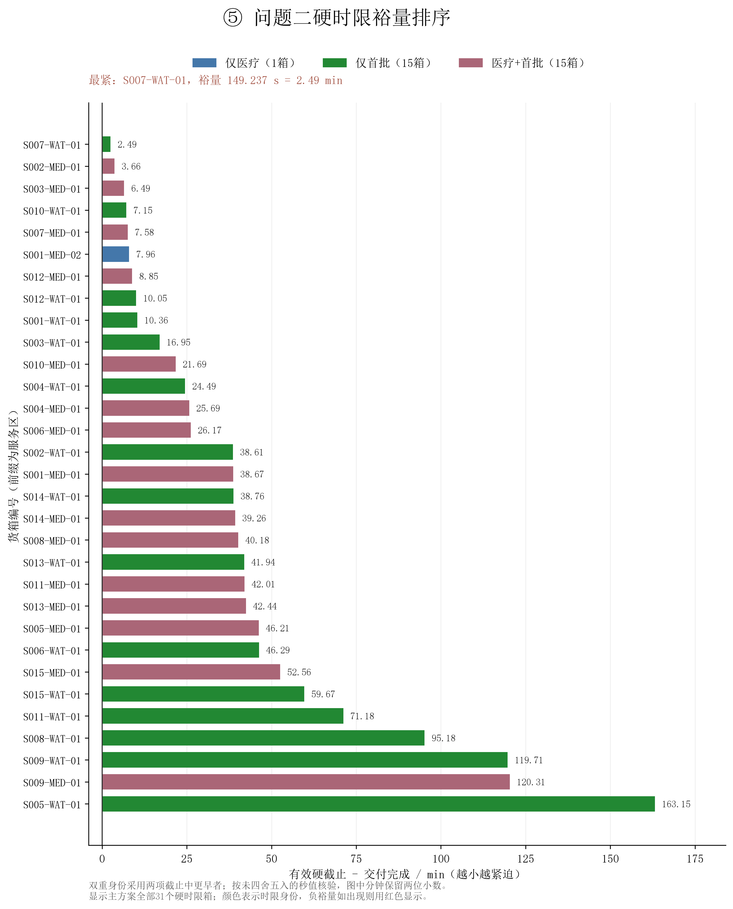

# 扩展图表说明

本批复用已保存主方案，仅重建地形剖面和派生统计量，没有重新优化。

代表剖面：O01→S008、O01→S014、Q2-029完整往返。
最紧硬时限箱为S007-WAT-01，裕量149.237秒（2.4873分钟）；31箱均满足硬时限。

Q1共18架次，运输能耗59.132260326 kWh，爬升附加项占4.3206%。
Q2共36架次，运输能耗95.845699225 kWh，爬升附加项占4.9765%。

40%时S004、S008不可行；45%时S002、S003、S004、S008、S012不可行。矩阵其他单元格只表示该服务区的独立组批可行性，不代表全场景可行。

## 公式与口径

水平与爬升分项直接使用既有公式审计F09、F10：Zhang等附录A(A1)的能量/航程关系具体化，附录C(C1)爬升功率分量积分后按题给效率折算。全可用电量航程标定与仅保留爬升势能附加项均为已有假设，不是完整实测飞行模型。
硬时限裕量 Δ_b=H_b-C_b，由审计F25的有效截止与完成时刻直接相减，单位秒；展示时除以60换算分钟。负值表示违反硬截止。能耗占比为分项能量除以总能量，是统计定义，不添加新物理假设。
沿途DEM按线段与每个闭像元的相交区间绘制。共享边界可能存在重叠高程，保留各像元；角点零长度接触用点显示。节点海拔取节点表，不用DEM替换。
可行性矩阵中的数字为已有词典序精确组批方案的服务区架次数；先核对该区全部原始货箱恰好交付一次，再显示数字。不可行格不填零。

## 复现与核验

`python scripts/plot_extended.py`；任意工作目录可使用入口的绝对路径。
图表为300 dpi PNG与内嵌字体矢量PDF；CSV保留未四舍五入计算值。logs/validation.json记录来源哈希、依赖版本、数值校验和既有文件保护校验。
逐航段分项相加、架次总量与完整方案能耗逐级核验；剖面最高高程和飞行几何对照保存值；31个硬时限身份从原始数据复核；135个矩阵单元格检查交付完整性、不可行诊断与架次数单调性。

## 01_地形与飞行高度剖面

## 02a_问题一能耗构成

## 02b_问题二能耗构成

## 05_硬时限裕量排序

## 06_安全余量服务区可行性矩阵

