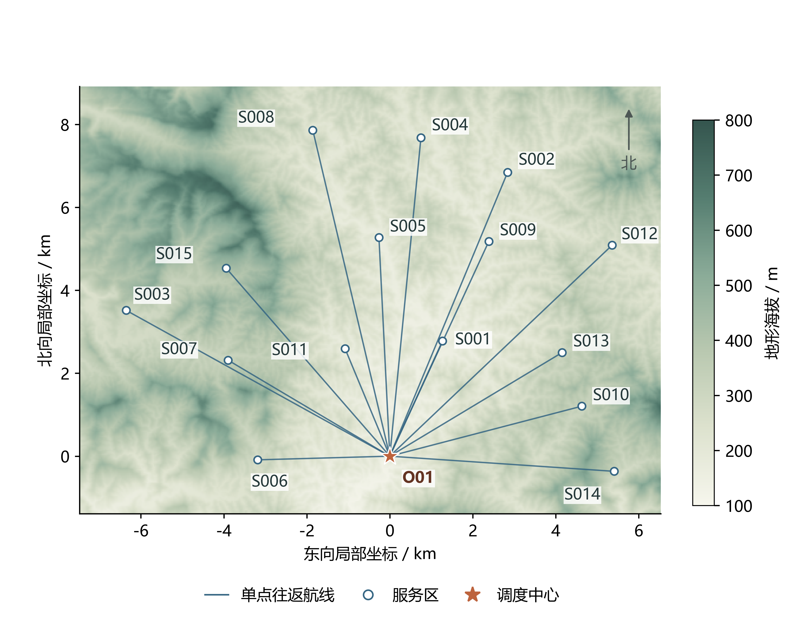
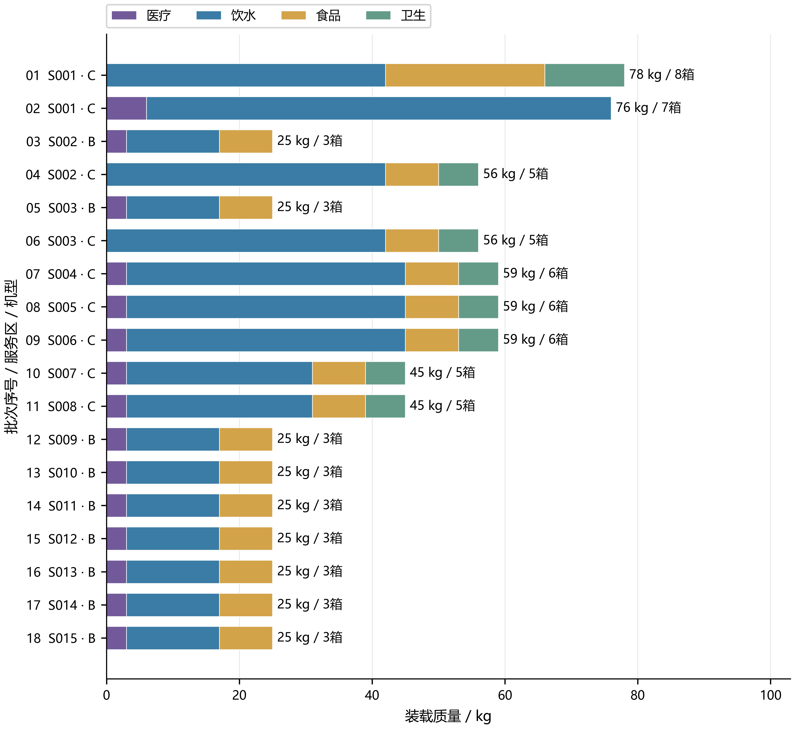
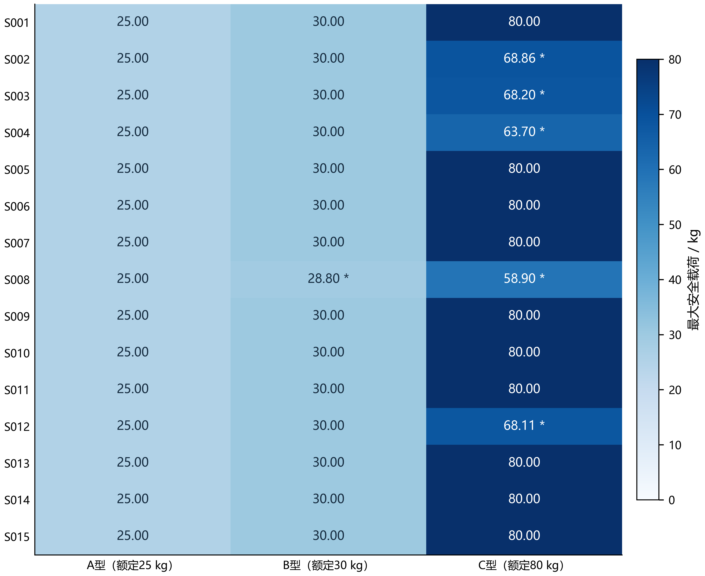
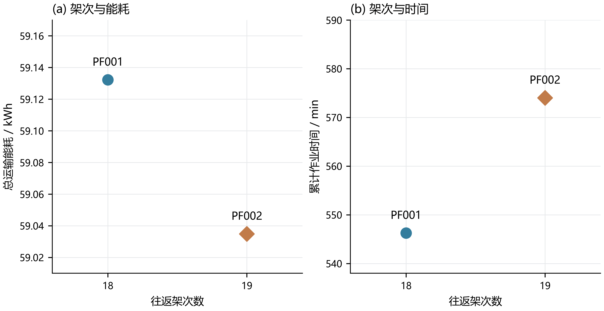
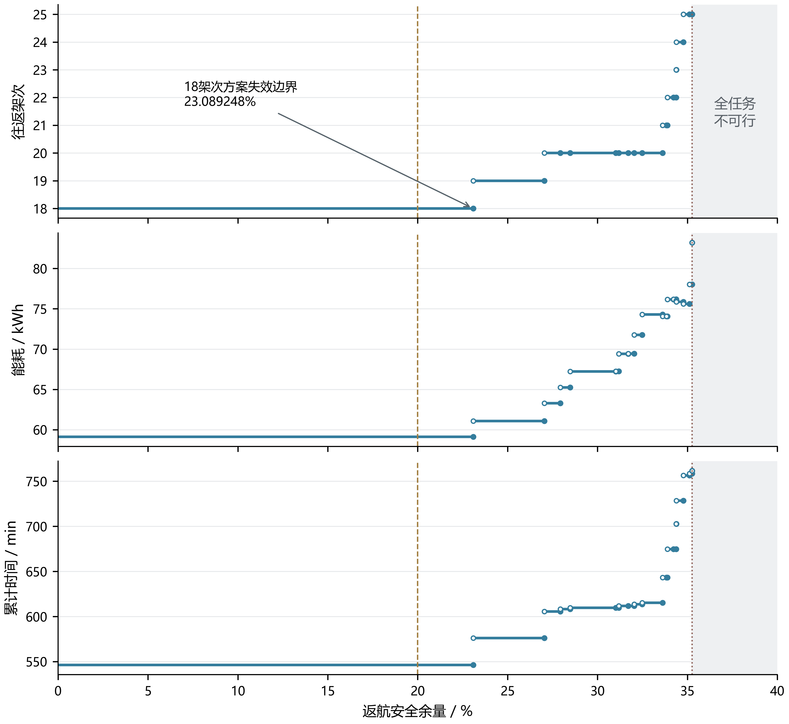
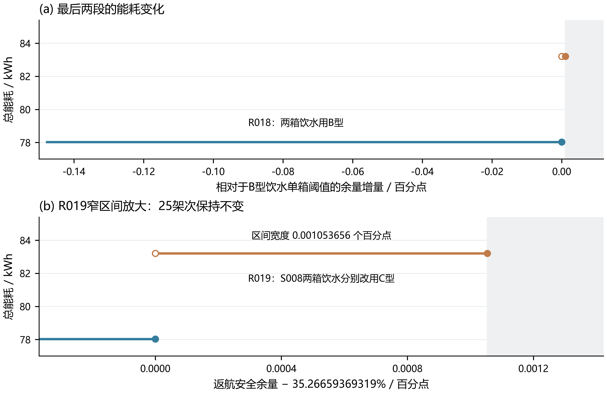

# 问题一：山区单点往返运输能力、货箱组批与安全余量优化

## 1 问题分析

山区物资运输的单架次能力同时受货箱质量、装载体积和往返能量约束。额定载荷只给出机型的结构上限，沿线地形引起的爬升和服务区距离决定这一上限能否在安全返航条件下实现。因此，需要先由节点与数字高程模型（DEM）建立航线成本，再将连续载荷能力转化为不可拆货箱的离散组合，不能直接以总质量除以额定载荷确定组批。

问题一规定每个架次采用 O01→Si→O01 的直接往返形式，单次仅服务一个服务区。去程携带该批全部货箱，到达后完成交付，返程有效载荷为零。由于本问不引入实体无人机、共享电池和时限调度，不同服务区之间没有公共资源竞争，组批可按区求解；全局架次数、运输能耗和累计作业时间由各区结果相加得到。这种可分性降低了求解规模，也为逐区最优方案合并提供了依据。

三个小项构成连续的建模过程。首先建立满足全部硬约束的整箱覆盖模型，给出每个服务区的具体批次。其次保留三个目标的非支配方案，比较减少往返与节约能量之间的代价，并明确推荐的优先级。最后将返航安全余量作为参数，重新计算最大安全载荷和可行组合，识别原方案首次失效、后续换机拆批及整个配送任务不可行的临界点。

本文中的累计作业时间是全部架次的准备、装载、飞行和交接时间之和，用于衡量完成配送的作业量。它与多机并行条件下的最晚完工时间含义不同。所给批次编号只用于标识货箱分配，不附带起飞顺序或资源调度承诺。

## 2 数据与模型准备

### 2.1 需求与运输参数

节点、机型和逐箱属性分别读取《调度中心与服务区.xlsx》《运输无人机数据.xlsx》和《物资需求与配送时限.xlsx》。研究对象包括 1 个调度中心、15 个服务区、3 种运输机型及 80 个不可拆分货箱，总质量为 758 kg，总体积为 2.011 m³。每个箱号与所属服务区建立一一对应关系，原始箱号保留至结果输出阶段。逐箱截止时间等字段供后续问题使用，不加入本问的可行性约束。

表1给出四类物资的单箱属性。同一区域、同一类型的货箱在本问具有相同质量、体积和处理时间，因而可以先按类型计数求解，再无放回地回填箱号。该处理只压缩等价决策，不减少必须完成的交付数量。

表1 四类货箱的数量与装载属性

| 类型 | 医疗 MED | 饮用水 WAT | 应急食品 FOD | 生活卫生 HYG |
|---|---:|---:|---:|---:|
| 全部需求/箱 | 16 | 36 | 19 | 9 |
| 单箱质量/kg | 3 | 14 | 8 | 6 |
| 单箱体积/m³ | 0.012 | 0.027 | 0.028 | 0.035 |

表2列出进入运输能力计算的机型参数。空机质量已经包含电池，不再重复增加电池质量；可用电量采用附件数值，不通过电压与容量重新替换。体积以各箱体积之和检验，计算时转换为整数升，避免小数累加影响恰好装满时的判断。

表2 运输机型的主要参数

| 参数 | A型 | B型 | C型 |
|---|---:|---:|---:|
| 空机质量（含电池）/kg | 70 | 65 | 69.9 |
| 额定载货质量/kg | 25 | 30 | 80 |
| 最大装载体积/m³ | 0.060 | 0.073 | 0.250 |
| 巡航速度/(m/s) | 12 | 15 | 15 |
| 最大爬升速度/(m/s) | 3 | 3 | 2.5 |
| 最大下降速度/(m/s) | 2.5 | 2.5 | 2 |
| 空载标准航程/m | 25000 | 28000 | 26000 |
| 满载标准航程/m | 20000 | 16000 | 12000 |
| 单组电池可用能量/kWh | 4.5 | 4.0 | 8.0 |
| 基准返航安全余量 | 20% | 20% | 20% |
| 爬升能耗效率 | 0.72 | 0.72 | 0.72 |

### 2.2 局部椭球坐标与水平距离

附件节点和 DEM 使用 WGS84 经纬度。为统一距离、速度与能耗单位，以 O01 为固定原点建立局部椭球平面坐标。原点经纬度为 109.2308517°E、23.0085095°N；WGS84 长半轴取 a=6378137 m，第一偏心率平方取 e²=0.0066943799901413165。记原点纬度为 φ0，其卯酉圈曲率半径和子午圈曲率半径分别为

$$N_0=\frac{a}{\sqrt{1-e^2\sin^2\varphi_0}},\qquad M_0=\frac{a(1-e^2)}{(1-e^2\sin^2\varphi_0)^{3/2}}.$$

所有经纬度先转换为弧度，节点 i 的坐标及单程水平距离定义为

$$x_i=N_0\cos\varphi_0(\lambda_i-\lambda_0),\qquad y_i=M_0(\varphi_i-\varphi_0),\qquad d_i=\sqrt{x_i^2+y_i^2}.$$

其中 x 轴向东、y 轴向北，全部节点使用同一原点和固定尺度。该局部近似适用于本研究区域的有限空间范围；题目没有强制指定计算投影，故将上述坐标选择明确列为处理口径。地面高差不并入水平距离，垂直运动单独计入爬升、下降与时间。计算得到各服务区单程距离约为 2.808—8.079 km。



图F01 调度中心、服务区与第一问直达航线。 基于附件节点与 DEM 绘制，水平坐标采用以 O01 为原点的 WGS84 局部椭球平面。每条航线连接 O01 与一个服务区，去返使用同一水平路径；图中高程来自原始 DEM，不表示已规划多点飞行或实体机调度。

### 2.3 DEM 取高程与航段结构

原始 DEM 的经纬度像元间距为 1/3600°，名义地面分辨率约为 30 m。局部平面变换对经纬度为仿射映射，因此平面直线对应经纬度平面中的直线。针对每条航线，完整求取线段与原始栅格的相交像元集合 C_i，包括恰好接触边界两侧和角点的像元。按 PixelIsPoint 中心注册处理索引，并保留中心至边界坐标的 0.5 像元偏移；不重采样或平滑高程。这里从原始 TIFF 点定位标签构造以样本为中心的网格支持区域；若改用已校正为像元角点的 GIS 变换，不得再次加 0.5。

题目规定巡航海拔为沿线最高地形高程以上 50 m。记节点表中的地面海拔为 z0、zi，则

$$H_i=\max_{r\in C_i}Z_r+50,\qquad a_i=H_i-z_0,\qquad b_i=H_i-(z_i+30).$$

O01 从地面起降，服务区作业高度为地面以上 30 m，故去程爬升 a_i、下降 b_i，返程爬升 b_i、下降 a_i。地形高度来自 DEM，节点作业海拔来自节点表，两者各自承担不同含义。预处理检查航线覆盖、缺失高程和非负爬升量；若发现巡航海拔低于作业高度，应报告数据或口径冲突，不能直接截断异常值。

## 3 模型假设与符号

在题目已给定的直接往返、整箱交付和安全余量规则基础上，作以下补充解释：标准航程对应附件可用电量下的等效水平飞行距离，固定载荷的水平能耗按距离比例折算；爬升附加电能按重力势能增量除以爬升效率计算，重力加速度 g0=9.80665 m/s²；下降附加能耗依附件取零，但下降用时仍计入；准备、装载、飞行与交接按顺序累加。由于没有提供箱体长宽高和摆放限制，本文只约束总体积，不建立三维几何装箱模型。

载荷—航程函数及能耗分项结构来自题目，水平和爬升分项的具体展开属于上述补充计算设定。题目未指定重力加速度数值，本次按用户要求统一取标准重力 g0=9.80665 m/s²；这是计算设定，不是题目强制值，也不是当地实测值。附件给出的最大爬升、最大下降速度被作为相应阶段的恒定计划速度，未另计加减速过渡；未给出投送悬停功率，因而不另加该能耗项。所有最优性与临界值结论均限定于所列参数、能耗表达式和问题一的可行域。安全余量以比例 ρ 表示，0≤ρ<1；例如 20% 在公式中使用 0.20。

表3 主要符号

| 符号 | 含义及单位 |
|---|---|
| i、g、k | 服务区、机型、货箱类型索引 |
| Q_g、V_g | 额定载货质量/kg、装载体积/m³ |
| m_g^0、E_g^use | 含电池空机质量/kg、可用能量/kWh |
| L_g^0、L_g^F | 空载、满载标准航程/m |
| η_g、ρ | 爬升效率、返航安全余量比例 |
| w_k、u_k、n_ik | 单箱质量/kg、体积/m³、区域需求箱数 |
| c、x_igc | 四类箱数向量、该机型与组合的执行次数 |
| Φ_gi(q)、q_gi^max | 往返能耗/kWh、连续最大安全载荷/kg |
| t_gi^fly、τ_gi(c) | 纯飞行时间/s、单架次作业时间/s |
| N、E、T | 总架次数、总运输能耗/kWh、累计作业时间/s |

## 4 模型建立

### 4.1 往返能耗与连续安全载荷

机型 g 在有效载荷 q 下的等效航程按题给关系计算：

$$L_g(q)=L_g^0-(L_g^0-L_g^F)\left(\frac{q}{Q_g}\right)^{3/2},\qquad 0\le q\le Q_g.$$

对服务区 i，一架次去程带货、返程空载，其总能耗为

$$\Phi_{gi}(q)=E_g^{use}d_i\left[\frac{1}{L_g(q)}+\frac{1}{L_g^0}\right]+\frac{g_0[(m_g^0+q)a_i+m_g^0b_i]}{\eta_g\,3.6\times10^6}.$$

式中 3.6×10⁶ 完成焦耳到千瓦时的单位转换。两个水平项分别使用带货航程和空载航程，不能将去程能耗乘以 2 代替整个往返。空载返程仍携带机体与电池，所以返程爬升能耗不为零。

返航安全约束及连续最大安全载荷定义为

$$\Phi_{gi}(q)\le(1-\rho)E_g^{use},\qquad q_{gi}^{max}(\rho)=\max\{q:0\le q\le Q_g,\ \Phi_{gi}(q)\le(1-\rho)E_g^{use}\}.$$

当空载往返能耗已超过预算时，可行集为空，记为“航线不可行”；当满载满足预算时，最大安全载荷取额定值；其余情况求能量约束等号的根。随着 q 增大，等效航程缩短、爬升能耗增加，因此往返能耗单调增加，可用二分法确定唯一载荷边界，并返回可行侧下界。程序的载荷区间精度为 10⁻⁶ kg，最终整箱判定仍使用原始能耗不等式。

这里的连续载荷尚未包含货箱体积和不可拆分条件。例如医疗、水、食品各 1 箱合计 25 kg、0.067 m³，虽达到 A 型载荷上限，却超过其 0.060 m³ 容量。因此安全载荷只能用于能力分析和初筛，不能直接替代组批约束。

### 4.2 飞行时间与作业成本

往返飞行由水平巡航和两端垂直运动组成：

$$t_{gi}^{fly}=\frac{2d_i}{v_g^c}+(a_i+b_i)\left(\frac{1}{v_g^{up}}+\frac{1}{v_g^{down}}\right).$$

设批次 c 共含 n(c) 箱，准备时间为 300 s，装载时间为每箱 30 s。根据附件的交接规则，A、B 型的作业时间为

$$\tau_{gi}(c)=t_{gi}^{fly}+450+60n(c),\qquad g\in\{A,B\}.$$

C 型的作业时间为

$$\tau_{Ci}(c)=t_{Ci}^{fly}+480+66n(c).$$

固定准备和交接基础时间均按每架次计一次。该模型计入返航飞行，不另增题目未提供的运输周转时间，也不在问题一加入充电等待或排队时长。

### 4.3 整箱候选与精确覆盖

按 MED、WAT、FOD、HYG 的固定顺序，以非负整数向量 c 表示一批箱数。其质量、体积和箱数分别为

$$q(c)=\sum_{k=1}^4w_kc_k,\qquad u(c)=\sum_{k=1}^4u_kc_k,\qquad n(c)=\sum_{k=1}^4c_k.$$

将非空且不超过区域需求的所有组合枚举后，服务区 i、机型 g 的可行候选集为

$$\mathcal P_{ig}(\rho)=\{c\in\mathbb Z_{\ge0}^4\setminus\{0\}:c\le n_i,\ q(c)\le Q_g,\ u(c)\le V_g,\ \Phi_{gi}(q(c))\le(1-\rho)E_g^{use}\}.$$

令 x_igc 为该候选执行的次数，建立逐类精确覆盖约束：

$$\sum_g\sum_{c\in\mathcal P_{ig}(\rho)}c_kx_{igc}=n_{ik},\qquad x_{igc}\in\mathbb Z_{\ge0},\quad\forall i,k.$$

一个数量组合可以重复执行，但每次从对应区域和类型的箱号清单中分配不同实箱。整数数量保证不可拆箱，等式覆盖保证不多送、不少送，无放回回填与逐箱核验保证每个货箱恰好安排一次。若某个必须交付的单箱对所有机型均不可行，则该服务区和整个配送任务不可行。

### 4.4 三目标与推荐优先关系

三个目标定义为

$$N=\sum_{i,g,c}x_{igc},\qquad E=\sum_{i,g,c}\Phi_{gi}(q(c))x_{igc},\qquad T=\sum_{i,g,c}\tau_{gi}(c)x_{igc}.$$

先求三目标非支配集合，再为基准方案采用字典序规则

$$\min_{lex}(N,E,T).$$

其含义是先最少架次，在达到最少架次的方案中最小化能耗，最后以累计作业时间破除前两项目标的平局。该优先关系体现减少重复往返和作业负担的选择，是本文的决策约定，并非题目唯一规定。候选枚举后，非线性能耗已转化为每种候选的常数成本，覆盖模型具有整数线性形式，无需直接求解混合整数非线性模型或人为设置超大权重。

## 5 求解方法

### 5.1 数量状态动态规划

对服务区 i，状态 s=(s1,s2,s3,s4) 表示待交付的各类箱数，F_i(s) 保存完成该状态的最优成本三元组。零状态为 (0,0,0)，不可达状态记为无穷大；按箱数递增计算

$$F_i(s)=\min_{lex}\{F_i(s-c)+(1,\Phi_{gi}(q(c)),\tau_{gi}(c)):c\in\mathcal P_{ig}(\rho),\ c\le s\}.$$

任何完整方案都可分解为最后一批和其余货物。若其余货物不是相应状态的最优解，用更优子方案替换即可改进整体，故上述递推具有最优子结构。不同服务区没有耦合约束，三个成本又具有可加性，逐区字典序最优解相加即为全局字典序最优解。

四类计数使状态数压缩为各类型需求加一的乘积。S001 的需求为 (2,8,3,2)，数量状态为 324 个；若逐箱编码，需要 32768 个状态。全部服务区共 644 个数量状态。基准余量下共保留 732 个机型—组合候选，因而可以采用完整枚举和精确递推。为使可加成本具有一致的传递比较关系，先将每个候选的能耗按 10⁻¹² kWh、作业时间按 10⁻⁶ s 的单位四舍五入为整数，再累加整数成本并按字典序精确比较；不对每次状态累加后的浮点总和重复舍入。可行性判断和结果汇总仍采用未量化的物理值，常规能量可行性容差为 10⁻⁹ kWh。最多 80 个非空批次引入的累计成本量化误差上界分别为 4×10⁻¹¹ kWh 和 4×10⁻⁵ s，独立高精度计算用于复核最终目标。

### 5.2 完整 Pareto 前沿

为保留目标权衡，将每个状态的单一成本替换为非支配标签集合，记为 \(\mathcal F_i(s)\)。一个标签若在 N、E、T 上均不优于另一标签，且至少一项更差，就可删除；该删除只在同一需求状态内进行。任意后续候选给两个标签增加相同成本，因此被支配标签不会重新成为非支配方案。

对每个服务区得到局部前沿后，逐区进行目标向量相加并删除被支配项：

$$\mathcal G_0=\{(0,0,0)\},\qquad\mathcal G_j=ND\{a+b:a\in\mathcal G_{j-1},\ b\in\mathcal F_j(n_j)\}.$$

其中 ND 表示非支配筛选。该过程保留当前有限模型下的完整前沿，每个不同目标向量输出一个箱号代表方案；同类型箱号互换不重复列出。支配判定对逐候选量化后累加的整数成本执行逐分量精确比较，与基准动态规划共用尺度。输出报告未量化的物理总能耗与累计作业时间，独立核验采用能耗 10⁻⁹ kWh、时间 10⁻⁶ s 的一致性容差；显示小数不参与可行性判断。

### 5.3 安全余量的临界事件扫描

改变余量时，某个固定批次的物理能耗不变，改变的是允许消耗的预算。先枚举全部满足质量和体积的 742 个候选，其中包含基准 20% 下不满足能量要求的 10 个候选，再计算各自的失效阈值

$$\rho_{igc}^{crit}=1-\frac{\Phi_{gi}(q(c))}{E_g^{use}}.$$

当 ρ 不超过该阈值时，候选满足能量要求；只有越过阈值才失效。相邻临界值之间的候选集合完全不变，所以最优目标值及按固定回溯规则选取的代表方案也不变。扫描全部候选临界事件即可定位方案切换，无需凭固定步长推断突变点。合并相邻、批次结构相同的最优代表方案后，得到最终区间。程序对余量使用 10⁻¹⁰ 个百分点的比较容差，仅用于浮点边界处理。

在不限制架次数和实体资源的本问中，“每个必须交付的单箱均至少有一种可行机型”是整个任务可行的必要充分条件。必要性来自每箱必须送达；充分性来自可以逐箱独立运输。合箱增加质量与体积，不能修复已经不可行的单箱，因此全任务余量上限可直接写为

$$\rho_{task}^{max}=\min_{i,k:n_{ik}>0}\ \max_{g:w_k\le Q_g,\ u_k\le V_g}\left[1-\frac{\Phi_{gi}(w_k)}{E_g^{use}}\right].$$

算法的主要步骤如下。

```text
读取节点、DEM、机型和80个箱号，检查单位与所属服务区
计算局部椭球坐标；完整遍历15条航线的相交像元
由最高地形确定巡航海拔、去返爬升和下降量
枚举质量、体积可行的全部非空数量组合
在20%余量下过滤候选，计算载荷边界并执行数量状态DP
回溯18架次基准；无放回分配箱号，逐批复核全部约束
保留各状态非支配标签，合并15区完整Pareto前沿
计算全部候选临界余量与单箱任务上限
扫描每个基本区间和等号端点，合并相同代表方案
输出典型情景、19段方案、18次转换和全部箱号明细
```

## 6 结果与讨论

### 6.1 基准货箱组批及最少架次证明

在 20% 返航安全余量下，全部货箱分为 18 架次，B、C 型各 9 架次，A 型未被基准最优方案选用。总能耗为 59.132260 kWh，累计纯飞行时间为 19288.516782 s，累计作业时间为 32776.516782 s，即 9.104588 h；最低返航剩余电量比例（SOC）为 23.089248%，全部批次满足能量约束。

这一架次数具有独立的严格下界。15 个服务区均有需求，且不能跨区组批，因此至少各需一次往返。S001 需求为 154 kg，S002、S003 各为 81 kg，均超过最大额定载荷 80 kg，这三个区域各至少需要两次。故总架次下界为 15+3=18。表4中的方案满足全部约束且恰好使用 18 架次，因而达到了该下界。



图F04 20% 返航余量下的 18 架次组批。 每批只服务一个区域；条形按四类物资的质量堆叠，行末标注该批总质量和总箱数，并标明服务区与机型。基准方案中 B、C 型各 9 架次。架次编号仅标识批次，不表示起飞先后。

表4 基准18架次摘要（数量向量依次为MED、WAT、FOD、HYG）

| 架次 | 服务区 | 机型 | 箱数向量 | 质量/kg | 体积/m³ | 能耗/kWh | 返航SOC/% |
|---|---|---|---|---:|---:|---:|---:|
| Q1-001 | S001 | C | (0,3,3,2) | 78 | 0.235 | 2.995776 | 62.5528 |
| Q1-002 | S001 | C | (2,5,0,0) | 76 | 0.159 | 2.917588 | 63.5301 |
| Q1-003 | S002 | B | (1,1,1,0) | 25 | 0.067 | 2.713473 | 32.1632 |
| Q1-004 | S002 | C | (0,3,1,1) | 56 | 0.144 | 5.721356 | 28.4830 |
| Q1-005 | S003 | B | (1,1,1,0) | 25 | 0.067 | 2.780078 | 30.4980 |
| Q1-006 | S003 | C | (0,3,1,1) | 56 | 0.144 | 5.765365 | 27.9329 |
| Q1-007 | S004 | C | (1,3,1,1) | 59 | 0.156 | 6.152860 | 23.0892 |
| Q1-008 | S005 | C | (1,3,1,1) | 59 | 0.156 | 4.222137 | 47.2233 |
| Q1-009 | S006 | C | (1,3,1,1) | 59 | 0.156 | 2.597936 | 67.5258 |
| Q1-010 | S007 | C | (1,2,1,1) | 45 | 0.129 | 3.411004 | 57.3625 |
| Q1-011 | S008 | C | (1,2,1,1) | 45 | 0.129 | 5.836021 | 27.0497 |
| Q1-012 | S009 | B | (1,1,1,0) | 25 | 0.067 | 2.096265 | 47.5934 |
| Q1-013 | S010 | B | (1,1,1,0) | 25 | 0.067 | 1.823217 | 54.4196 |
| Q1-014 | S011 | B | (1,1,1,0) | 25 | 0.067 | 1.073937 | 73.1516 |
| Q1-015 | S012 | B | (1,1,1,0) | 25 | 0.067 | 2.752600 | 31.1850 |
| Q1-016 | S013 | B | (1,1,1,0) | 25 | 0.067 | 1.824828 | 54.3793 |
| Q1-017 | S014 | B | (1,1,1,0) | 25 | 0.067 | 2.140291 | 46.4927 |
| Q1-018 | S015 | B | (1,1,1,0) | 25 | 0.067 | 2.307529 | 42.3118 |

表4所对应的80个真实箱号在[逐箱分配表](../数据/batch_box_assignments.csv)中完整列出，每个箱号恰好一次；[批次明细](../数据/batches.csv)另列出时间与能耗分项。最接近安全能量边界的是 S004 的 C 型批次：59 kg 的货物仍低于连续安全载荷 63.698 kg，但其返航 SOC 已降至 23.089248%。相对于 6.4 kWh 的能量预算，剩余裕量仅为约 0.247140 kWh，因此这一批次首先响应余量提高。

不同机型的约束不宜只按额定载重判断。基准下 S008 的 B、C 型最大安全载荷分别约为 28.801 kg 和 58.904 kg，已受能量限制；部分近区则仍可达到额定值。A 型未进入所选方案，反映了质量、体积、能耗和架次优先共同作用，并不表示 A 型在所有航线上均不可执行。



图F08 20% 返航余量下的机型—服务区最大安全载荷。 连续载荷由额定质量与往返能量共同约束，体积在整箱候选层另行检验；载荷接近额定值不意味着任意同质量的货箱组合均可装入。

### 6.2 两个非支配方案及目标取舍

完整前沿只包含表5中的两个不同目标向量。除 S008 外，其余 14 个服务区的局部前沿均只有一个目标点；S008 的两种非支配组批决定了全部全局权衡。独立逐箱算法得到了同样的局部和全局前沿，从而支持该完整性结论。

表5 三目标非支配方案

| 方案 | 架次N | 能耗E/kWh | 累计作业时间T/s | B/C型架次 |
|---|---:|---:|---:|---:|
| PF001，架次优先 | 18 | 59.132260 | 32776.516782 | 9/9 |
| PF002，能耗优先 | 19 | 59.034878 | 34440.488752 | 11/8 |



图F09 第一问完整 Pareto 前沿的两个目标点。 PF001 为 18 架次、59.132260 kWh、32776.516782 s；PF002 为 19 架次、59.034878 kWh、34440.488752 s。时间为累计作业时间，两个点各表示一类目标等价方案。

PF001 在 S008 使用一次 C 型运输全部 45 kg 货物，能耗为 5.836021 kWh。PF002 将其拆为两次 B 型：饮用水与卫生用品合计 20 kg，医疗、饮用水与食品合计 25 kg，两批能耗分别为 2.763431、2.975207 kWh。其余区域的组批相同。因此，PF002 用增加一次完整往返换取较小机型的能耗优势。

这一调整使全局能耗减少 0.097382588 kWh，降幅为 0.164686%，同时增加 1 架次和 1663.971970 s，累计作业时间增加 5.076720%，约 27.73 min。六种完整字典序均已列入对照：N→E→T、N→T→E、T→N→E、T→E→N 均选择 PF001，E→N→T、E→T→N 选择 PF002。该排序对照保留完整前沿，不以六个偏好端点替代非支配搜索。本文采用减少往返负担的基准偏好，推荐 PF001，同时保留 PF002 作为能源优先方案。没有能源价格和任务价值参数时，不将这种取舍进一步称为经济最优。

S008 的合批、拆批结构及成本对照可见补充图F10。

### 6.3 安全余量对载荷和组批的影响

统一提高三种机型的余量时，连续安全载荷呈现额定载荷平台、能量限制下降和空载不可行三个阶段。当能量约束在内部起作用时，对等号关系求导得到

$$\frac{\mathrm d q_{gi}^{max}}{\mathrm d\rho}=-\frac{E_g^{use}}{\Phi'_{gi}(q_{gi}^{max})}<0.$$

所以最大安全载荷不随余量提高而增加，但不应假定线性下降。以 S008 为例，C 型在 20%、25%、30%、35% 下的最大载荷依次为 58.904、49.704、36.813、15.682 kg；B 型在 40% 下仍可携带约 1.398 kg，却已无法运送最轻的 3 kg 医疗箱。连续意义上仍能载货，并不保证不可拆箱需求可交付。

常规敏感性情景统一为 5%、10%、15%、20%、25%、30%、35%、40%、45% 九档，并保留零余量、局部阈值附近和更高余量的补充情景，合计 18 个。情景表用于直观对照，精确边界仍由完整事件扫描确定。可行范围内共有 110 个不同候选内部临界值，划分出 111 个基本区间；合并相邻相同最优代表方案后，得到 19 段方案和 18 次转换。每段保留一套确定的最优代表，不枚举目标值相同的所有箱号分配。基准方案从 0% 一直保持到 23.089248385317727%，说明适度降低基准余量并未改善该字典序目标。超过这一临界值，S004 的 59 kg C 型批次失效，改为 B 型 17 kg 与 C 型 42 kg 两批，全局架次由 18 增为 19。



图F11 返航安全余量变化下的最优运输指标。 三种机型统一改变余量，始终采用架次、能耗、累计作业时间的字典序；阶梯由候选临界事件确定。各阈值等号属于左侧既有方案，超过全任务上限后不再绘制虚假的零成本点。

继续提高余量，会交替出现拆批和换机。超过 27.04974165042051% 时，S008 的 45 kg C 型批次拆为 B 型 14 kg 与 C 型 31 kg，架次增至 20。之后 S003、S002 的原 B 型 25 kg 与 C 型 56 kg 组合陆续改为两批 C 型，架次数不变但能耗增加。35% 余量下需要 25 架次，总能耗为 75.608929 kWh，累计作业时间为 45384.207697 s，较 20% 基准分别增加 38.89%、27.86% 和 38.47%。

最少架次数随余量增加必然不减，因为可行方案集合不断收缩；总能耗却可在架次增加时局部下降。例如跨过 33.625670586616486%，全局从 20 架次变为 21 架次，能耗由 74.294644 降至 74.063524 kWh。较低余量时，后一个方案虽然节能，却因多用一架次而不能在字典序中胜出。这个现象来自目标优先级，不违背固定批次能耗与余量无关的物理设定。

19 段方案的指标对照见附表A及补充图F12。

### 6.4 全任务的可行上限

全任务上限由 S008 的两个饮用水箱决定，每箱质量 14 kg、体积 0.027 m³。A、B、C 型单独运送该箱所能承受的最大余量分别为 30.07866990319662%、35.266593693194835% 和 35.26764734919061%。因此，允许任意拆批和换机时，全部交付仍只能保持到

$$\rho_{task}^{max}=35.26764734919061\%.$$

B、C 型阈值仅相差约 0.00105365599578 个百分点，但对应不同的最后方案。超过 B 型阈值后，两箱水必须分别换为 C 型运送，架次仍为 25，总能耗却从 78.030685 跳至 83.209189 kWh。达到 C 型阈值的等号时仍满足预算，继续提高余量则没有任何机型可以运送该必须交付的单箱，故整个任务不可行。



图F14 S008 饮用水单箱阈值附近的末端变化。 B、C 型对应阈值分别为 35.266593693194835% 和 35.26764734919061%；跨过 B 型阈值后两箱水分别换为 C 型，架次仍为 25。达到 C 型阈值时仍可行，超过后全任务不可行。

这一上限是给定数据和确定性公式中的可行边界，并非建议实际把余量设置在边界附近。由于最末两个事件非常接近，粗步长情景表会遗漏换机阶段；论文显示的小数也不能替代原能耗不等式的边界判定。完整 19 段结果列于附表A，各段输出一套确定的箱号代表方案。

## 7 模型检验与适用范围

模型采用几何与组批两条独立路线核验。几何审核重新读取节点和 DEM，对航线包围盒内的闭像元矩形逐个进行线段裁剪，共核对 15 条航线、3554 个航线像元访问；与主程序的全部像元集合、最高点、距离和爬升量一致。组批审核重新读取原始工作簿，以 40 位 Decimal 计算成本，并采用真实箱号位掩码非支配动态规划，覆盖 33592 个状态和 8228062 次标签转移，得到相同完整前沿。

对每套输出方案，另按真实箱号复算质量、体积、时间、能耗和返航 SOC，检查全部 80 箱恰好一次、同批同区以及各约束。敏感性使用独立数量状态算法核对全部 742 个候选、111 个区间中点和 112 个端点，检查 660 条批次记录及 3285 条载荷记录。最大逐架次能耗差小于 9×10⁻¹⁶ kWh，最大载荷差约为 8.94×10⁻⁷ kg，均属于不同数值实现的舍入差异。

上述核验支持模型实现、组合完整性和结果一致性，不替代能耗模型的物理标定。局部椭球距离、固定航速、附件效率和确定性 DEM 构成了本问的计算环境，风场、载荷姿态、电池老化和实际能耗误差没有相应数据可供估计。装载体积相加也不能保证有长宽高限制时的几何可装性。后续若加入实体机、电池、通信和交付时限，应继承航段成本与箱号数据，再建立资源调度约束，不能直接将本问的可行组批视为已完成完整救援调度。

本章的[数据来源与处理说明](数据来源与处理说明.md)及[数据字段字典](../数据/data_dictionary.csv)随文提供。结果可从[航线表](../数据/routes.csv)、[完整前沿表](../数据/pareto.csv)、[余量区间表](../数据/reserve_intervals.csv)和[方案转换表](../数据/reserve_transitions.csv)复核；原始机器结果和独立审核分别保存在[基准结果](../../results/question1_batching/solution.json)、[基准审核](../../results/question1_batching/independent_audit.json)、[多目标审核](../../results/question1_multiobjective/validation.json)和[余量审核](../../results/question1_reserve_sensitivity/validation.json)中。

## 附表A 完整19段最优组批结果

区间端点以百分数显示，保留 13 位小数用于精细对照。R001 为闭区间，其余均为左开右闭；等号使用前一方案，超过上界才切换。表格小数为 JSON 数值的显示结果，不代表同等物理测量精度，边界核验以未舍入能耗与机器文件为准。

| 方案 | 余量下界/% | 余量上界/% | 架次 | 能耗/kWh | 累计作业时间/s |
|---|---:|---:|---:|---:|---:|
| R001 | 0.0000000000000 | 23.0892483853177 | 18 | 59.132260 | 32776.517 |
| R002 | 23.0892483853177 | 27.0497416504205 | 19 | 61.074311 | 34566.158 |
| R003 | 27.0497416504205 | 27.9329413127020 | 20 | 63.291052 | 36336.000 |
| R004 | 27.9329413127020 | 28.4830474506757 | 20 | 65.243746 | 36493.568 |
| R005 | 28.4830474506757 | 31.0195472783217 | 20 | 67.228732 | 36586.686 |
| R006 | 31.0195472783217 | 31.1850011427517 | 20 | 67.238740 | 36586.686 |
| R007 | 31.1850011427517 | 31.7071883606018 | 20 | 69.408520 | 36704.537 |
| R008 | 31.7071883606018 | 32.0425013503069 | 20 | 69.424946 | 36704.537 |
| R009 | 32.0425013503069 | 32.4811592274753 | 20 | 71.760603 | 36819.950 |
| R010 | 32.4811592274753 | 33.6256705866165 | 20 | 74.294644 | 36919.819 |
| R011 | 33.6256705866165 | 33.8339754343124 | 21 | 74.063524 | 38595.791 |
| R012 | 33.8339754343124 | 33.8923305097678 | 21 | 74.067570 | 38595.791 |
| R013 | 33.8923305097678 | 34.2308201641017 | 22 | 76.155346 | 40490.401 |
| R014 | 34.2308201641017 | 34.3742868320870 | 22 | 76.175644 | 40490.401 |
| R015 | 34.3742868320870 | 34.3903617693857 | 23 | 76.003313 | 42164.630 |
| R016 | 34.3903617693857 | 34.7777451891848 | 24 | 75.863704 | 43702.236 |
| R017 | 34.7777451891848 | 35.1185088280533 | 25 | 75.608929 | 45384.208 |
| R018 | 35.1185088280533 | 35.2665936931948 | 25 | 78.030685 | 45505.621 |
| R019 | 35.2665936931948 | 35.2676473491906 | 25 | 83.209189 | 45693.360 |